# Open Language — Architecture

**Status:** Living document · **Last updated:** 2026-08-25 · **Audience:** human contributors and LLM agents

This document explains what Open Language is, how it is put together, and — most importantly — **why** it
is put together that way. Where a decision looks unusual, the rationale is stated inline rather than left
for the reader to reverse-engineer.

Companion documents:

| Document | Covers |
|---|---|
| [README.md](../README.md) | Install, run, prerequisites |
| [CLAUDE.md](../CLAUDE.md) | Coding rules enforced on every change |
| [.specify/memory/constitution.md](../.specify/memory/constitution.md) | The governance rules those coding rules derive from |
| [docs/design-system.md](design-system.md) | Visual tokens, component patterns, dark mode, accessibility |
| [specs/](../specs/) | Per-feature spec → plan → tasks artifacts |
| [reference/TRANSCRIPTION_INTEGRATION.md](../reference/TRANSCRIPTION_INTEGRATION.md) | Reference notes on the faster-whisper / CUDA integration |

---

## 1. What this project is

Open Language is a **local, privacy-first spoken language-practice application**. A learner picks a
role-play scenario ("buy a train ticket"), speaks or types in their target language, and an AI partner
answers in character — out loud. Along the way the learner can ask for grammar feedback, translations,
alternative phrasings, and word lookups; save unknown words; and later drill those words with
spaced-repetition flashcards.

### The one decision everything else follows from

**Every AI component runs on the user's own machine. There is no cloud, no API key, no account.**

- Speech-to-text: `faster-whisper`, loaded in-process
- Language model: `Ollama` serving `llama3.1:8b` on `localhost:11434`
- Text-to-speech: `Piper`, loaded in-process from local `.onnx` voice files
- Persistence: a single SQLite file under `~/.open-language/`

**Why this matters architecturally.** Practising a language means saying clumsy, personal, embarrassing
things thousands of times. Shipping that audio to a third party is a real privacy cost, and metered API
calls make a learner ration the exact behaviour the app exists to encourage. Committing to local-only
inference removes both problems, and it cascades into almost every other choice in this document:

- **No auth, no multi-tenancy, no rate limiting.** One user, one machine, one database file.
- **No "offline mode".** There is no online mode to contrast it with. The spec says so explicitly.
- **Latency is CPU/GPU-bound, not network-bound.** Optimisation effort goes into model loading, thread
  offloading, and caching results — not into request batching or retries.
- **Heavy work must leave the event loop.** Whisper, Piper, and Ollama calls are blocking and CPU-bound.
  Every one of them is wrapped in `run_in_executor`, because a single slow synthesis would otherwise
  freeze the whole single-process app.
- **Caching is aggressive and permanent.** A TTS clip or an LLM explanation costs seconds of local
  compute, so results are written to SQLite or to disk and never recomputed.

---

## 2. System context

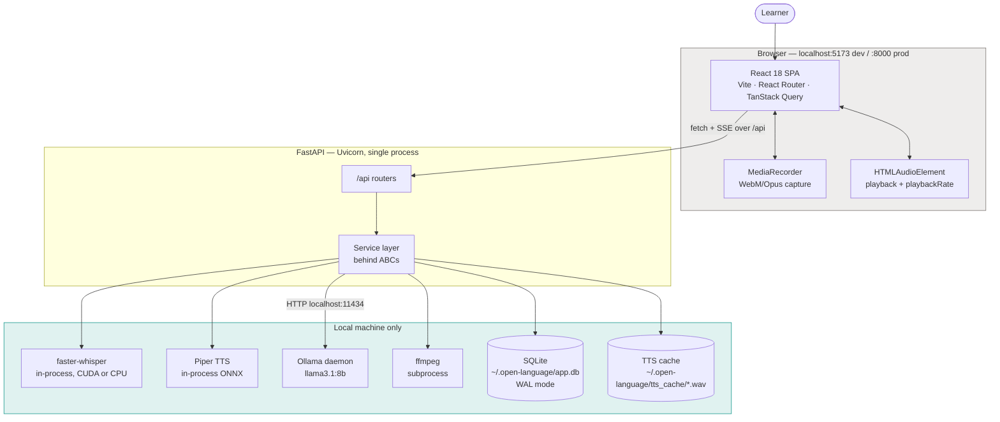

Nothing in this diagram crosses the machine boundary. The only network call in the entire runtime is
`localhost:11434` to Ollama.

---

## 3. How this codebase gets built: spec-driven development

This is not a repository where someone opened an editor and started typing. It is built with
**SpecKit v0.3.0**, a spec-driven development (SDD) framework, under a written **constitution**.
Understanding that is a prerequisite to contributing — human or agent.

### The workflow

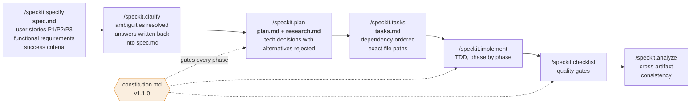

Every feature leaves a permanent paper trail in `specs/<NNN>-<slug>/`:

```
specs/001-speak-roleplay-chat/
├── spec.md          What and why, in user-facing terms. No technology named.
├── research.md      Every technical decision, its rationale, and what was rejected.
├── plan.md          Technical context + a Constitution Check gate table.
├── data-model.md    Entities, fields, relationships.
├── tasks.md         Dependency-ordered tasks with exact file paths.
├── quickstart.md    How to run/verify the feature.
├── contracts/       API and service-interface contracts, written before code.
└── checklists/      Pre-merge quality validation.
```

**Why keep all this?** Three reasons that matter in practice:

1. **`research.md` is the "why" archive.** When you wonder why the app converts WebM to WAV with an
   ffmpeg subprocess instead of handing bytes to Whisper, the answer is written down with the rejected
   alternatives (`pydub`: slower, same ffmpeg dependency; `soundfile`: cannot transcode). Nobody has to
   re-litigate it.
2. **`spec.md` clarifications are binding decisions.** Ambiguities are resolved once, recorded as Q/A,
   and encoded into requirements. The flashcard classification rules, for example, are not folklore —
   their precedence order was decided in a clarification session and is quoted verbatim in the docstring
   of `app/flashcards/services/classification.py`.
3. **Agents need seeding, not spelunking.** An LLM agent handed this repo can read one feature folder and
   know the intent, the constraints, and the rejected paths, instead of inferring intent from code.

### The constitution and its five principles

[`.specify/memory/constitution.md`](../.specify/memory/constitution.md) (v1.1.0, ratified 2026-03-15) is
the top of the rule hierarchy. It supersedes all other style guides.

| Principle | Practical effect in this codebase |
|---|---|
| **I. Clean Code** | Functions ≤ 20 lines. Names reveal intent — `conversation_repository`, never `conv_repo`. Comments explain *why*. Dead code is deleted, not commented out. |
| **II. SOLID** | Every external dependency sits behind an ABC. Violations must be justified in the plan's Complexity Tracking table. |
| **III. TDD (non-negotiable)** | No production code before a failing test. Red → Green → Refactor. 90% coverage is enforced by `--cov-fail-under=90` in `pyproject.toml` and by Vitest thresholds — the build fails, this is not an honour system. |
| **IV. Simple UI & UX** | One primary action per screen. Immediate feedback. Error messages say what to do next. Accessibility is a quality gate, not polish. |
| **V. Extensibility & Compartmentalization** | Each feature domain has one public interface. No direct cross-module imports. Extension points are declared as abstractions *before* the first concrete implementation. |

**Why a constitution at all?** The domain is open-ended — new languages, new exercise types, new
pedagogies, new local model backends. A project like that dies from accumulated coupling long before it
dies from missing features. The constitution front-loads the discipline that keeps growth *additive*.
Principle V is the load-bearing one: it is the reason the flashcards feature could be added as a whole
new domain in `app/flashcards/` without editing a single line of the chat feature.

---

## 4. Backend architecture

### Layers

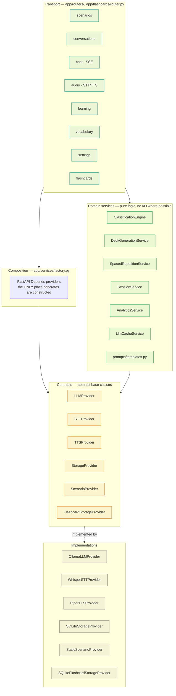

**The rule that shapes this diagram:** routers and domain services depend only on the ABC layer. The only
module allowed to name a concrete class is `factory.py`. This is Dependency Inversion applied literally,
and it buys three things:

- **Testability.** 323 backend tests run with zero models loaded. A fake `LLMProvider` is ten lines.
- **Swappability.** Replacing Ollama with llama.cpp, or Piper with Coqui, is one new class plus one line
  in the factory. No router changes.
- **Startup cost control.** Concrete providers are imported *inside* the factory functions, not at module
  top level, so importing a router does not drag in `faster_whisper` or `piper`.

### Dependency injection wiring

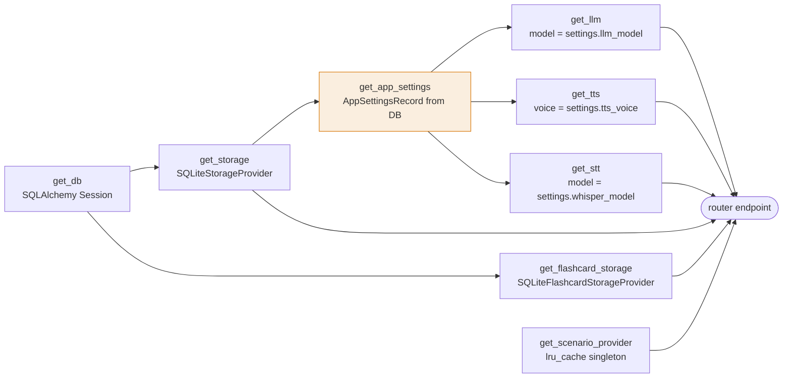

Note the chain through `get_app_settings`. **Providers are built per-request from settings stored in the
database, not from process-level configuration.** That is what satisfies SC-005 from the spec — "a new
LLM model selected in settings takes effect on the next message without an application restart." There is
no reload, no restart, no cache to bust: the next request simply constructs a provider with the new model
name.

Two deliberate exceptions to per-request construction:

- `_stt_providers` is a module-level dict keyed by Whisper model size. Whisper model loading costs
  seconds; rebuilding it per request would be unusable. Changing the model in Settings loads the new one
  once and keeps both resident.
- `_get_scenario_provider` is `lru_cache`d because `StaticScenarioProvider` holds `_last_id` state to
  guarantee the "never the same scenario twice in a row" requirement (FR-003).

### Configuration

`app/config.py` uses `pydantic-settings` with the `OPEN_LANGUAGE_` prefix, reading `backend/.env`.
A `field_validator` runs `expanduser()` on path settings so `~/...` in `.env` resolves correctly.

There are **two tiers of configuration**, and the distinction is intentional:

| Tier | Where | Changes | Examples |
|---|---|---|---|
| Deployment config | `.env` → `Settings` | Requires restart | db path, voice directory, Ollama URL, host/port, Whisper device |
| User preferences | `app_settings` table → `AppSettingsRecord` | Live, next request | LLM model, TTS voice, Whisper model size, target/native language, suggestion count |

Anything a learner would plausibly want to change mid-session lives in the database.

### Database and migrations

`app/database.py` creates one engine with two PRAGMAs applied on every connect:

- `journal_mode=WAL` — lets the history screen read while a message write is in flight. Chosen in
  research Decision 5 over async SQLAlchemy, which adds complexity for no benefit at single-user scale.
- `foreign_keys=ON` — SQLite disables FK enforcement by default; the cascade rules below only work
  because this is switched on explicitly.

Migrations are deliberately primitive. There is no Alembic:

```python
Base.metadata.create_all(bind=_engine)   # new tables appear automatically
_migrate_db()                            # ALTER TABLE ADD COLUMN, idempotent by try/except
```

**Why no migration tool?** Research Decision 7: the database is a single file on one user's laptop, all
changes so far have been purely additive (new tables, new nullable/defaulted columns), and there is no
production fleet to coordinate. `_add_column_if_missing()` swallows the `OperationalError` that SQLite
raises when the column already exists.

`_add_column_if_missing()` tolerates exactly one failure — SQLite's `duplicate column name` — and
re-raises everything else, so a missing table or a malformed definition surfaces instead of leaving the
schema quietly wrong.

> **This is technical debt with a known expiry date.** It still cannot express a rename, a type change, a
> data backfill, or a rollback. The moment a change is not purely additive, this needs to become Alembic.
> Flagged here so nobody discovers it mid-incident.

---

## 5. Data model

```mermaid
erDiagram
    CONVERSATIONS ||--o{ MESSAGES : "has"
    MESSAGES ||--o{ LEARNING_TOOL_RESULTS : "caches"
    CONVERSATIONS ||--o{ VOCABULARY_ITEMS : "sourced from"
    VOCABULARY_ITEMS ||--o{ DECK_CARDS : "appears as"
    VOCABULARY_ITEMS ||--o{ CARD_RESULTS : "rated in"
    VOCABULARY_ITEMS ||--o{ FLASHCARD_RATING_HISTORY : "rolling window"
    VOCABULARY_ITEMS ||--o| SPACED_REPETITION_SCHEDULE : "scheduled by"
    VOCABULARY_ITEMS ||--o{ WORD_LLM_CACHE : "explained by"
    DECKS ||--o{ DECK_CARDS : "contains"
    DECKS ||--o{ PRACTICE_SESSIONS : "practised in"
    PRACTICE_SESSIONS ||--o{ CARD_RESULTS : "records"
    PRACTICE_SESSIONS ||--o{ FLASHCARD_RATING_HISTORY : "produces"
    PRACTICE_SESSIONS ||--o| SESSION_CLASSIFICATION_SNAPSHOTS : "snapshots"

    CONVERSATIONS {
        int id PK
        string scenario_id
        string scenario_title
        string target_language
        string native_language
        enum status "active|completed"
        datetime started_at
        datetime ended_at
        string llm_model
        text custom_prompt "null unless user-authored scenario"
    }
    MESSAGES {
        int id PK
        int conversation_id FK "CASCADE"
        enum role "user|assistant"
        text content
        enum input_source "voice|keyboard|null"
        datetime created_at
        string tts_audio_path "cached wav"
    }
    LEARNING_TOOL_RESULTS {
        int id PK
        int message_id FK "CASCADE"
        enum tool_type "grammar|translation|alternative_phrasing|word_lookup"
        string input_selection
        text result
        datetime created_at
    }
    VOCABULARY_ITEMS {
        int id PK
        string word "UNIQUE with target_language"
        string translation
        string target_language
        string native_language
        int source_conversation_id FK "SET NULL"
        datetime saved_at
        string classification "not_practiced|difficult|almost_learned|learned"
        bool manual_override
        string tts_cache_path
    }
    DECKS {
        int id PK
        string name
        string practice_mode "recall|listen|produce|fill_blank"
        string algorithm
        int requested_size
        datetime created_at
        datetime last_practiced_at
    }
    DECK_CARDS {
        int id PK
        int deck_id FK "CASCADE"
        int vocabulary_item_id FK "SET NULL"
        int position "UNIQUE per deck"
        string fill_blank_sentence "LLM-generated"
    }
    PRACTICE_SESSIONS {
        int id PK
        int deck_id FK "SET NULL — survives deck deletion"
        string practice_mode
        string algorithm
        datetime started_at
        datetime ended_at
        int total_cards
        int cards_reviewed
        int knew_it_count
        int guessed_count
        int didnt_know_count
        bool completed
    }
    CARD_RESULTS {
        int id PK
        int session_id FK "CASCADE"
        int vocabulary_item_id FK "SET NULL — survives word deletion"
        string rating "knew_it|guessed|didnt_know"
        string response_type
        text user_response
        datetime rated_at
    }
    FLASHCARD_RATING_HISTORY {
        int id PK
        int vocabulary_item_id FK "CASCADE"
        string rating
        datetime rated_at
        int session_id FK "CASCADE"
    }
    SPACED_REPETITION_SCHEDULE {
        int id PK
        int vocabulary_item_id FK "CASCADE, UNIQUE"
        int interval_stage
        datetime last_practiced_at
        datetime next_due_at
    }
    WORD_LLM_CACHE {
        int id PK
        int vocabulary_item_id FK "CASCADE"
        string cache_type "meanings|usage|phrases|similar"
        string language
        text content
        datetime generated_at
    }
    SESSION_CLASSIFICATION_SNAPSHOTS {
        int id PK
        int session_id FK "CASCADE"
        datetime snapshotted_at
        int not_practiced_count
        int difficult_count
        int almost_learned_count
        int learned_count
    }
```

### Why the FK actions differ

The `ondelete` choices are not incidental — each encodes a product decision from a spec clarification.

- **`CASCADE`** where the child is meaningless without the parent: messages under a conversation,
  tool results under a message, rating history under a word.
- **`SET NULL`** where history must outlive its subject. Deleting a deck keeps its `practice_sessions`
  as orphans; deleting a word keeps its `card_results`. Both were explicit clarifications: *"allow
  deletion; historical records are retained as orphaned records so analytics remain intact."* A learner
  cleaning up their word list must not silently rewrite their own progress charts.

### Why some things are cached in tables

Three tables exist purely as caches, and all three exist because local inference is slow:

- `learning_tool_results` — unique on `(message_id, tool_type, input_selection)`, populated through a
  `get_or_create_learning_result(..., compute)` callback. Re-opening a grammar explanation you read five
  minutes ago is instant instead of a fresh LLM round-trip. The API returns `cached: true/false` so the UI
  can tell the truth about what just happened.
- `word_llm_cache` — unique on `(word, cache_type, language)`, holding LLM-generated meanings, usage
  examples, phrases, and similar words. Target: <10s first fetch, <1s cached.
- `messages.tts_audio_path` / `vocabulary_items.tts_cache_path` — pointers into
  `~/.open-language/tts_cache/`. Audio synthesis is re-used forever; the row stores the path, the disk
  stores the bytes.

### The `snapshots` table, and why aggregation is not enough

`session_classification_snapshots` stores the *distribution* of word classifications at the end of every
session. It is denormalised on purpose: classification is a mutable field on `vocabulary_items`, so
"what did my progress look like three weeks ago?" is unanswerable from current state. Writing a snapshot
at each session end is the only way to draw the classification-over-time chart honestly.

---

## 6. Key runtime flows

### 6.1 A conversation turn (voice input → spoken reply)

```mermaid
sequenceDiagram
    autonumber
    actor U as Learner
    participant FE as React · Chat.tsx
    participant REC as useRecorder
    participant AUD as /api/audio/transcribe
    participant FF as ffmpeg
    participant W as faster-whisper
    participant CH as POST /api/chat/:id/message
    participant DB as SQLite
    participant O as Ollama
    participant P as Piper

    U->>FE: tap record
    FE->>REC: startRecording
    REC->>REC: MediaRecorder, audio/webm with opus codec
    U->>FE: tap stop
    REC-->>FE: Blob
    FE->>AUD: POST multipart + language hint
    AUD->>FF: subprocess → 16kHz mono PCM WAV
    FF-->>AUD: temp wav path
    AUD->>W: run_in_executor(transcribe)
    Note over W: CUDA attempted first;<br/>on any cuda/cublas/cudnn error<br/>the model reloads on CPU and retries
    W-->>AUD: text + detected_language
    AUD-->>FE: {text}
    Note over AUD: temp wav deleted in finally

    FE->>CH: POST {content, input_source:"voice"}
    activate CH
    CH->>DB: save user message
    CH-->>FE: SSE user_message_saved
    CH->>DB: load full history
    CH->>O: run_in_executor(chat_stream, system + history)
    O-->>CH: tokens
    loop each token
        CH-->>FE: SSE data: {token}
    end
    CH->>DB: save assistant message
    CH->>P: run_in_executor(synthesize) — fire and forget
    CH-->>FE: SSE data: {done, message_id}
    deactivate CH
    P->>DB: set tts_audio_path
    FE->>FE: audio element src = /api/audio/tts/:message_id
    U->>FE: optional: replay at 0.6× playbackRate
```

Points worth internalising:

- **Every message is persisted the instant it exists** (FR-024). The user message is written *before* the
  LLM is called, so a crash mid-generation loses at most the AI's half of one turn.
- **The full history is re-sent on every turn.** Ollama is stateless per call; `conversations` +
  `messages` in SQLite are the only source of truth for context.
- **TTS is fire-and-forget.** `loop.run_in_executor(None, _synthesize)` is launched without `await`, so the
  `done` event reaches the browser immediately. The frontend then requests `/api/audio/tts/{id}`, which
  serves the cached file if synthesis finished or synthesises on demand if it did not. The endpoint is
  idempotent, which is what makes the race harmless.
- **Slow replay is a client-side `playbackRate`, never a re-synthesis.** Research Decision 2: Piper has no
  speed parameter, and server-side time-stretching would burn CPU for a trivial UX affordance.
- **SSE over WebSocket**, and `fetch` + `ReadableStream` over `EventSource`. Turn-taking is strictly
  unidirectional, so WebSocket bidirectionality is wasted complexity; `EventSource` was rejected because
  it cannot send a POST body and the conversation history has to go up with the request.

> **Accepted decision — batched tokens, streamed transport.** `chat.py` does
> `token_list = await loop.run_in_executor(None, _stream_tokens)` where `_stream_tokens` does
> `list(llm.chat_stream(...))`. That materialises the whole response before the first SSE frame, then
> replays the tokens instantly, so the "typing" effect is cosmetic rather than real. This is a deliberate
> trade: bridging a sync generator running in an executor thread to an async generator needs a queue and
> its own cancellation handling, and on a local model the whole response arrives in a couple of seconds
> anyway. The transport, the client parser, and `LLMProvider.chat_stream` all support true incremental
> streaming already, so this stays a one-function change whenever the latency starts to matter.

### 6.2 Prompt construction

All prompts live in one module, `app/prompts/templates.py`, as pure string-building functions with no I/O.
That makes them unit-testable (`tests/unit/prompts/test_templates.py`) and keeps prompt engineering out of
the routers.

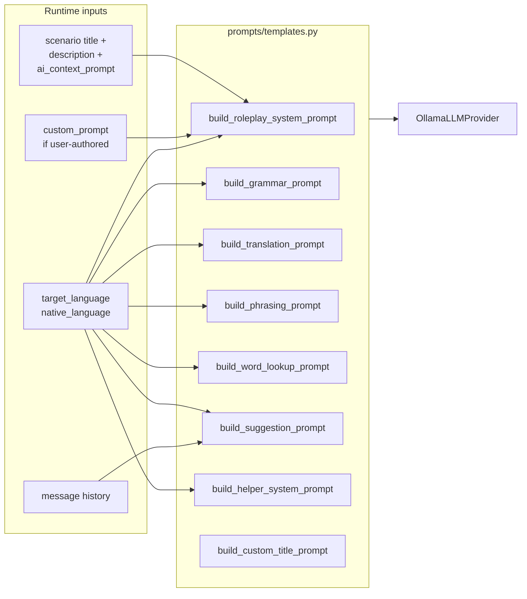

Two prompt-design decisions carry real product weight:

- **Language enforcement is done in the prompt, not with a language-detection library.** The role-play
  system prompt opens with an emphatic `CRITICAL LANGUAGE RULE` block forbidding *any* native-language
  token. This directly implements FR-009 and its clarification: redirect only when the learner's *entire*
  message is in the wrong language, never for isolated loanwords. A detection library would have to
  re-implement that nuance; the model already understands it.
- **The helper and the suggestion prompts explicitly forbid continuing the role-play.** These features run
  on the same model and the same conversation text, so without `Do NOT continue any roleplay` the model
  drifts back into character and answers as the ticket agent instead of as a tutor.

### 6.3 The "no shortcuts" pedagogy, expressed in architecture

Suggested responses and the expression helper are deliberately **read-only**. There is no tap-to-insert,
no copy-to-input, no send button. From FR-020 and FR-023, and from the clarification session:

> *"Neither — suggestions and expression-helper responses are read-only reference text; the user must
> speak or type them manually to reinforce active production."*

This is friction on purpose. Recognition is not production; a learner who taps "send" on a generated
sentence has practised nothing. The expression helper also keeps its own conversation thread
(`_helper_sessions`, keyed by a client-generated session id) so that asking "how do I say X?" never
pollutes the role-play context.

Helper threads live in `HelperSessionStore` ([helper_sessions.py](../backend/app/services/helper_sessions.py)),
injected through `factory.get_helper_sessions()`. They are the one piece of conversational state not in
SQLite — deliberately, because a throwaway "how do I say X?" lookup is not learning history worth keeping.
The store is bounded rather than unbounded: least-recently-used eviction past 50 threads and a 2-hour idle
expiry, so a long-running process cannot accumulate them without limit.

### 6.4 Flashcards: the learning loop

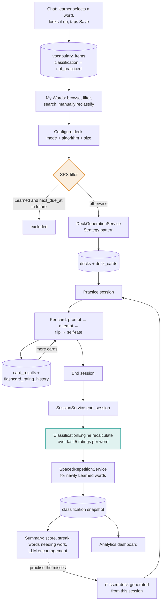

**Four practice modes**, each testing a different retrieval direction:

| Mode | Prompt shown | What it trains |
|---|---|---|
| `recall` | Target-language word | Comprehension (L2 → L1) |
| `listen` | Audio only, no text | Listening comprehension |
| `produce` | Native-language word | Production (L1 → L2) — the hard direction |
| `fill_blank` | LLM-generated sentence with `___` | Contextual use, not isolated lookup |

`fill_blank` sentences are generated once at deck-build time and stored in `deck_cards.fill_blank_sentence`
via `LlmCacheService`, so a deck is never blocked on the model mid-session.

**Deck generation uses the Strategy pattern** (`deck_generation.py`) — a `_STRATEGIES` registry mapping
algorithm names to objects satisfying an `AlgorithmStrategy` Protocol. This is Open/Closed made concrete:
a new algorithm is a new class plus a registry entry, with no edit to any existing strategy. Unknown
algorithm names fall back to random selection rather than raising, so a stale deck config cannot brick the
screen.

### 6.5 Classification: a pure function with a documented precedence order

`app/flashcards/services/classification.py` has **no I/O at all**. It takes a list of rating strings
(most recent first, max five) plus the current classification, and returns the new classification. That
purity is why it can carry the most intricate business rules in the app while remaining trivially testable.

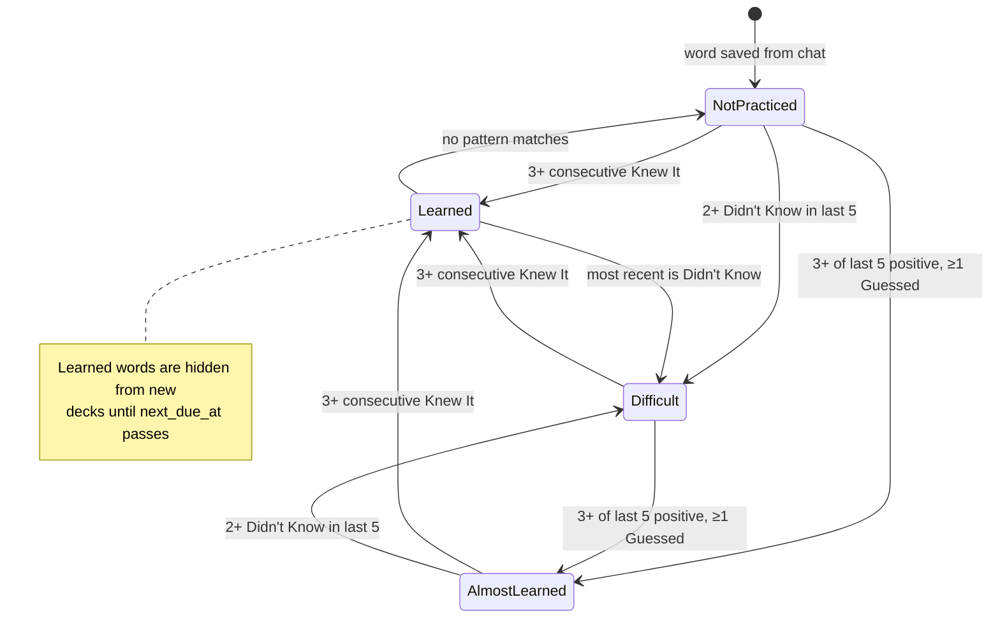

Rules are evaluated in strict priority order, and the order itself was a clarification decision:

1. Three consecutive `knew_it` at the head of the window → **Learned**.
   *Clarified: "Streak wins — 3 consecutive Knew Its always promotes to Learned, overriding any Didn't
   Knows in the same window."*
2. Currently Learned and the newest rating is `didnt_know` → **Difficult** (regression).
3. Two or more `didnt_know` in the last five → **Difficult**.
4. At least three of the last five are `guessed` or `knew_it`, with at least one `guessed` →
   **Almost Learned**.
5. Otherwise, hold.

**`manual_override` and why it is temporary.** A learner can force a classification from the word list.
That sets `manual_override = true`, which makes the next recalculation *skip* the word — and then clear
the flag. The override survives exactly one session, after which the automatic system resumes. The
rationale: a manual correction is a one-off nudge, not a permanent opt-out, and a word silently frozen
forever would quietly corrupt the learner's own analytics.

### 6.6 Spaced repetition

`SpacedRepetitionService` advances a word along a fixed ladder of intervals, in days:

```
stage:     1     2     3     4      5      6      7
days:      1     3     7    14     30     60    120
```

| Rating | Effect |
|---|---|
| `knew_it` | advance one stage, capped at 7 |
| `guessed` | hold the current stage |
| `didnt_know` | reset to stage 1 |

*Clarified: "Knew It advances; Guessed Correctly holds the current stage; Didn't Know resets."*

Scheduling applies only to words that have reached **Learned**. Everything below that classification is
still in acquisition and is eligible for every deck. Once Learned, `_filter_srs_eligible()` in the router
removes the word from new decks until `next_due_at` has passed — which is what stops decks from being
clogged with words the learner already owns.

`update_schedule()` takes its storage as a typed `FlashcardStorageProvider` parameter, so a call that
does not match the interface is a type error rather than a runtime surprise — this method previously
passed an argument the interface does not accept and raised `TypeError` whenever a word was promoted to
Learned, because the unit tests covered only the two pure methods and never exercised the persistence
path. `TestUpdateSchedule` now covers it.

---

## 7. Frontend architecture

### Structure

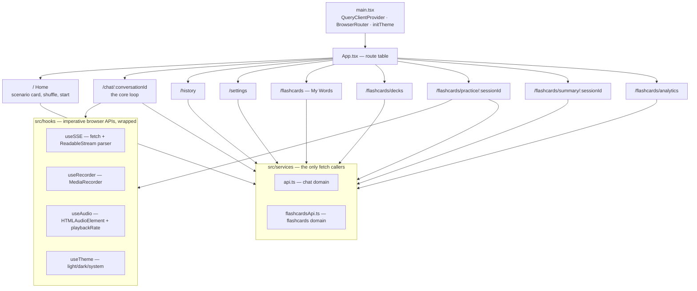

### State: three kinds, three mechanisms

The most important frontend decision is that there is **no global state library** — no Redux, no Zustand.
State is classified by lifetime and each kind gets the cheapest tool that fits:

| Kind | Mechanism | Why |
|---|---|---|
| Server state | TanStack Query (`staleTime: 30s`, `retry: 1`) | Caching, invalidation, and loading states are its whole job. |
| Streaming conversation state | `ConversationProvider` context | Tokens arrive dozens of times per second and mutate the last message in place — Query is the wrong shape for this. |
| Ephemeral session state | `useState` / `useReducer` in the component | Current card index, timer, accumulated ratings. Research Decision 8: *"this is not server state — it lives in the component tree until session end, when it is flushed to the API."* |

The `useSSE` hook holds an `AbortController` so navigating away mid-stream cancels the request cleanly, and
it discriminates `AbortError` from genuine failures so cancelling never surfaces an error banner.

### Design system

All UI work is bound by [docs/design-system.md](design-system.md). The short version — a *warm minimal*
language: warm stone neutrals plus a teal primary, Plus Jakarta Sans, generous line heights for reading.
The rules that get violated most often, and why they exist:

- **Never hardcode a hex colour.** Use the CSS custom-property tokens in `index.css`.
- **Never hardcode `#fff` for text on a primary background** — use `var(--color-text-on-primary)`. In dark
  mode the primary is *light* teal and needs *dark* text; a hardcoded white is invisible.
- **Navigation text uses `--color-text`, not `--color-primary`** — the latter produced a blue-on-dark-blue
  contrast failure in dark mode.
- Cards use `--radius-lg`; shadows use the warm-tinted `--shadow-sm/md/lg`; back links use
  `--color-text-muted`.

Dark mode is driven by a `data-theme` attribute on `<html>`, applied by `initTheme()` before React mounts
so there is no flash of the wrong theme. Three states: `light`, `dark`, and `system` (attribute removed,
`prefers-color-scheme` decides).

---

## 8. Testing strategy

TDD is constitutionally mandatory: **no production code exists before a failing test for it**. The
enforcement is mechanical, not cultural — coverage thresholds fail the build.

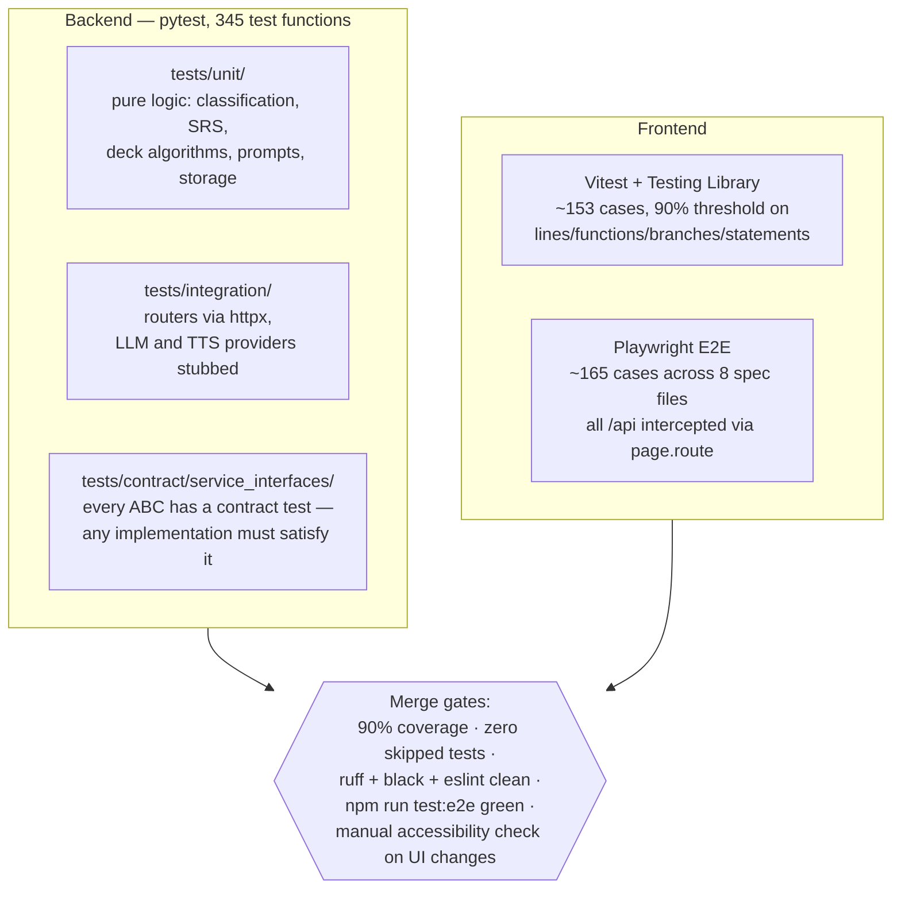

Two conventions deserve emphasis:

- **Contract tests are the guarantee behind the ABC layer.** `tests/contract/service_interfaces/` tests the
  *interface*, not an implementation. Swapping Ollama for another backend means making the new class pass
  `test_llm_provider.py` — the contract is executable, not prose. This is Liskov Substitution with teeth.
- **No test touches a real model.** On the frontend, every API call is intercepted with `page.route()`,
  and SSE endpoints are faked with `route.fulfill({ headers: {'Content-Type': 'text/event-stream'}, body })`
  using the helpers in `frontend/e2e/fixtures.ts`. On the backend, the flashcard integration fixtures
  override `get_llm` and `get_tts` with deterministic stubs. Both matter for the same reason: results must
  not depend on whether an Ollama daemon or a Piper voice happens to be installed on the machine running
  the suite, which is the only way this can be a mandatory pre-merge gate.

Commands:

```bash
backend/.venv/bin/pytest --cov=app --cov-report=term-missing   # backend, fails under 90%
cd frontend && npm test                                        # Vitest
cd frontend && npm run test:e2e                                # Playwright, starts dev server itself
```

**Python must always run through `backend/.venv/`.** Never `pip install --break-system-packages`,
`--user`, or a bare `pip install` — the system Python enforces PEP 668 and a global install risks the OS
toolchain.

---

## 9. Runtime topology

Development and production differ only in who serves the static assets.

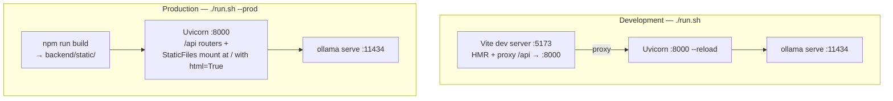

**Why single-port in production.** Research Decision 4: one origin means no CORS configuration and no
reverse proxy for what is fundamentally a desktop application. `StaticFiles(..., html=True)` also provides
the SPA fallback — unknown paths return `index.html`, which is what lets React Router own client-side
routing. Note the ordering constraint in `main.py`: the catch-all static mount at `/` is registered
**after** every `/api` router, because a mount at `/` would otherwise shadow them.

`run.sh` is the single entry point and does real work beyond starting processes: it verifies prerequisites
(Python 3.11+, Node 20+, ffmpeg, espeak-ng, Ollama), creates the venv, installs both dependency trees,
pulls the Ollama model, and downloads Piper voices — deriving each voice's HuggingFace path from its
`lang_REGION-name-quality` name. Logs go to `/tmp/open-language-{backend,frontend,ollama}.log`.

`espeak-ng` is easy to miss: Piper needs it for phonemization, and its absence surfaces as a confusing
runtime TTS failure rather than a startup error — which is exactly why `run.sh` checks for it up front.

### Graceful degradation

Local inference fails in specific, predictable ways, and each has a designed response:

| Failure | Response |
|---|---|
| CUDA libraries missing or broken | `WhisperSTTProvider` catches any error whose text mentions cuda/cublas/cudnn, reloads the model on CPU with `int8`, and retries the same audio. The learner sees slower transcription, not an error. |
| Ollama down | `LLMError` → SSE frame `{"error": "The AI is not responding. Please try again."}` — plain language, actionable, per Principle IV. |
| Empty or unintelligible audio | HTTP 400 with *"Could not understand audio. Please speak clearly and try again."* Conversation state is untouched. |
| ffmpeg conversion failure | HTTP 422; the temp WAV is removed in a `finally` block regardless. |
| Unhandled exception anywhere | Global handler in `main.py` logs the traceback server-side and returns a generic 500 — internals never leak into the UI. |

---

## 10. Repository map

```
open-language/
├── CLAUDE.md                    Coding rules — read before any change
├── README.md                    Install and run
├── run.sh                       Setup + launch, all modes
├── .env.example                 Deployment config template
│
├── .specify/                    SpecKit framework
│   ├── memory/constitution.md   ← the governing document
│   ├── templates/               spec / plan / tasks / checklist templates
│   └── scripts/bash/            branch setup, agent-context sync
│
├── .claude/commands/            speckit.* slash commands for Claude Code
│
├── specs/                       Per-feature artifacts (the "why" archive)
│   ├── 001-speak-roleplay-chat/
│   └── 002-vocabulary-flashcards/
│
├── docs/
│   ├── design-system.md         Tokens, components, dark mode, a11y
│   └── architecture.md          ← this file
│
├── reference/
│   └── TRANSCRIPTION_INTEGRATION.md   faster-whisper + CUDA notes
│
├── backend/
│   ├── pyproject.toml           Deps, pytest 90% gate, ruff, black, mypy strict
│   ├── .venv/                   The only Python environment to use
│   └── app/
│       ├── main.py              App assembly, router order, static mount
│       ├── config.py            pydantic-settings, OPEN_LANGUAGE_ prefix
│       ├── database.py          Engine, WAL + FK pragmas, create_all, migrations
│       ├── models/              SQLAlchemy ORM — chat domain
│       ├── routers/             HTTP transport — chat domain
│       ├── prompts/templates.py All LLM prompts, pure functions
│       ├── services/
│       │   ├── factory.py       DI composition root
│       │   ├── helper_sessions.py  Bounded, expiring helper threads
│       │   ├── llm/             base.py ABC + ollama.py
│       │   ├── stt/             base.py ABC + whisper.py
│       │   ├── tts/             base.py ABC + piper.py + voices.py
│       │   ├── storage/         base.py ABC + sqlite.py
│       │   ├── scenario/        base.py ABC + static.py
│       │   └── audio/           conversion.py — ffmpeg subprocess
│       └── flashcards/          Self-contained domain (Principle V)
│           ├── router.py        ← the domain's public interface
│           ├── models.py        7 tables
│           ├── schemas.py       Pydantic contracts
│           └── services/        classification, deck_generation, srs,
│                                session, analytics, llm_cache, storage
│
└── frontend/
    ├── vite.config.ts           Dev proxy, build → ../backend/static, Vitest thresholds
    ├── playwright.config.ts     E2E config, starts its own dev server
    ├── e2e/                     8 spec files + fixtures.ts
    └── src/
        ├── main.tsx             Providers, theme init
        ├── App.tsx              Routes
        ├── index.css            Design tokens
        ├── pages/               One per route
        ├── components/          chat/ · flashcards/ · scenario/ · shared/
        ├── hooks/               useSSE, useRecorder, useAudio, useTheme
        ├── services/            api.ts, flashcardsApi.ts
        └── store/               conversationStore.tsx (context)
```

### Feature history

| Branch | Feature | Delivered |
|---|---|---|
| `001-speak-roleplay-chat` | Scenarios, voice/text chat, learning tools, word lookup + save, suggestions, expression helper, history, settings | Merged |
| `002-vocabulary-flashcards` | Word library, 4 deck algorithms, 4 practice modes, SRS, session summary, analytics dashboard | Merged |
| `003-mywords-page-redesign` | My Words page UI/UX | In progress on `develop` |

`master` is the release branch; `develop` is the integration branch; feature branches are numbered and
created by `.specify/scripts/bash/create-new-feature.sh`.

---

## 11. Working on this codebase

### If you are a human contributor

1. Read the constitution first. It is short and it is binding.
2. Do not start with code. Start with `/speckit.specify` — the spec is the deliverable that everything
   else derives from.
3. Write the failing test first. This is checked, not assumed.
4. Run each shell command as its own step. The project rule against chaining with `&&`/`;`/`|` exists so a
   reviewer can approve commands individually; read-only pipelines are the exception.
5. Before any frontend change is "done": `npm run test:e2e` must pass, and the change must survive a manual
   accessibility check in both light and dark mode.
6. Python goes through `backend/.venv/` — always.

### If you are an LLM agent

The load-bearing context, in priority order:

1. **`CLAUDE.md`** — non-negotiable coding rules for this repo.
2. **`.specify/memory/constitution.md`** — the principles those rules encode.
3. **`specs/<feature>/spec.md` and `research.md`** — the intent and the rejected alternatives for whatever
   you are touching. Read these before proposing a design; the question may already be settled.
4. **`docs/design-system.md`** — mandatory before any UI work. Token violations are the single most common
   review failure.
5. **This document** — the shape of the whole system.

Traps specific to this codebase:

- Never instantiate a concrete provider inside a router or a service. Go through `factory.py`.
- Never import across domain boundaries — `app/flashcards/` reaches the rest of the app only through the
  shared ABCs and `factory.py`.
- Never hardcode a colour, a radius, or a shadow in the frontend.
- Never add a network call to a third-party service. Local-only is the product, not a preference.
- Any function over 20 lines needs a justification, and any SOLID violation needs a Complexity Tracking
  entry in the plan.

### Open items and known debt

Collected from the sections above so they are findable in one place:

| Item | Where | Severity |
|---|---|---|
| Token streaming is batched, not incremental — the typing effect is cosmetic | `app/routers/chat.py` | Accepted trade-off; revisit if perceived latency matters |
| `_add_column_if_missing()` cannot express renames, type changes, or backfills | `app/database.py` | Fine while changes stay additive; replace with Alembic otherwise |

**Resolved 2026-08-25:** the `upsert_srs_schedule()` signature mismatch that raised `TypeError` when a word
was promoted to Learned; unbounded `_helper_sessions` state; `_add_column_if_missing()` swallowing every
exception; a debug `print()` in the transcribe endpoint; a `from_cache` flag that always reported `true`;
two integration tests that silently depended on a real Ollama and Piper being installed; a
mixed-review deck test that failed roughly one run in five because its fixture issued the same word id to
two classifications; and a stray `backend/~/` scratch database left by a literal-tilde path.
