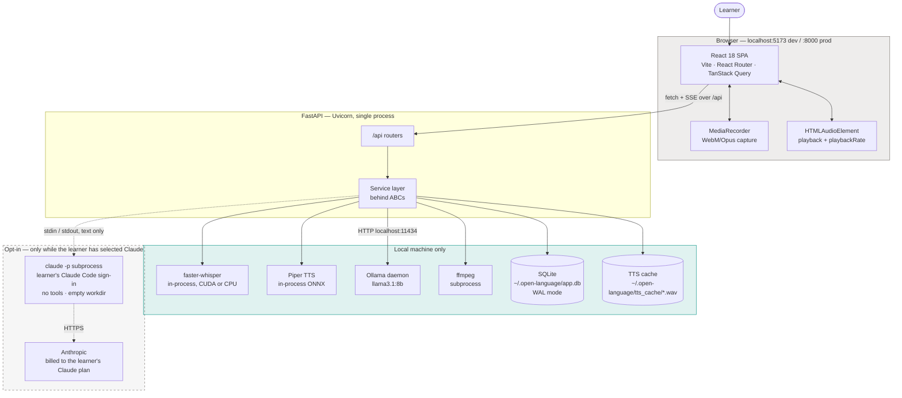
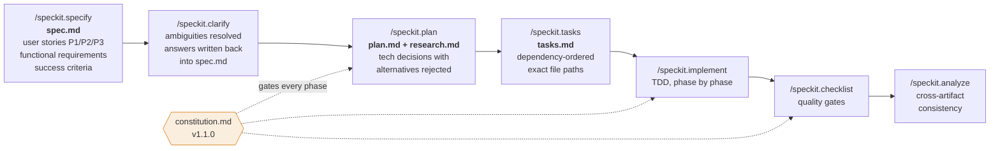
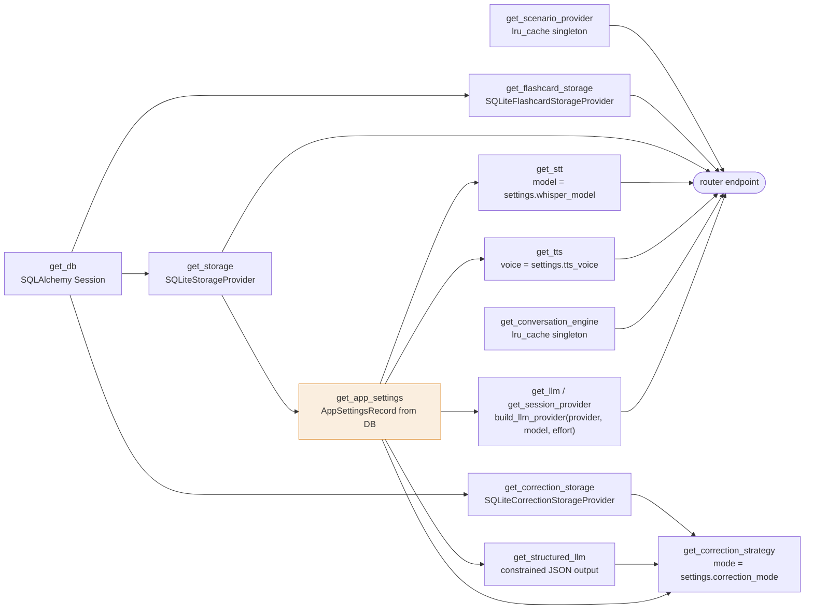
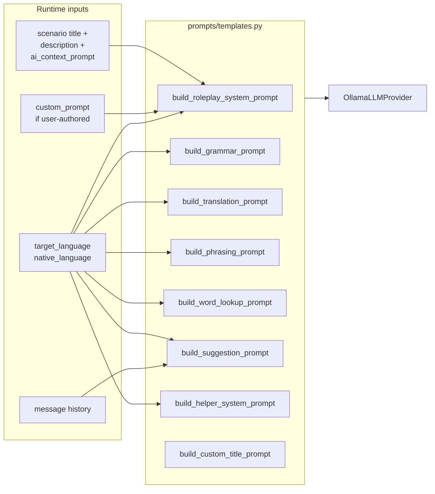
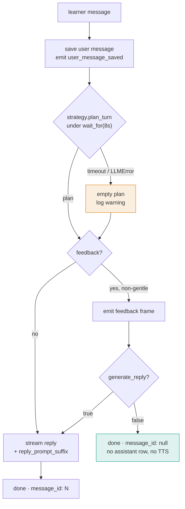
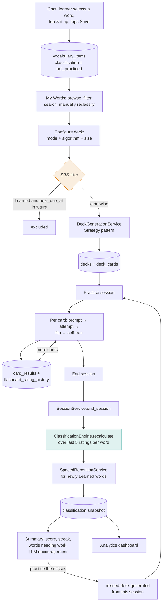
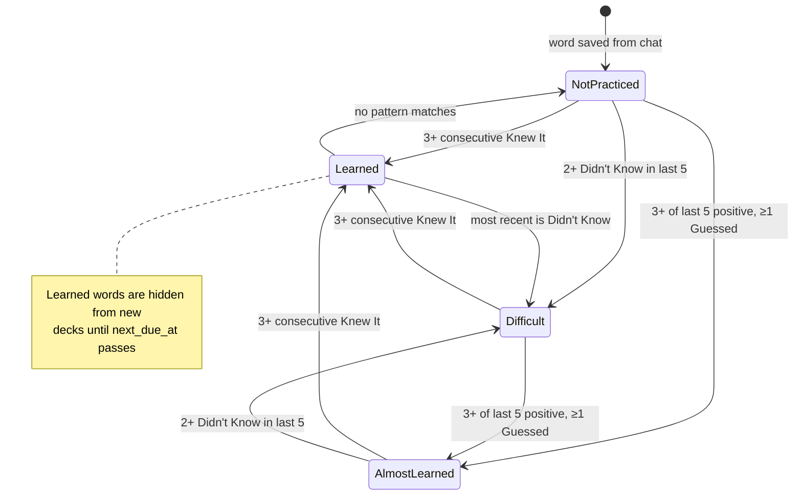
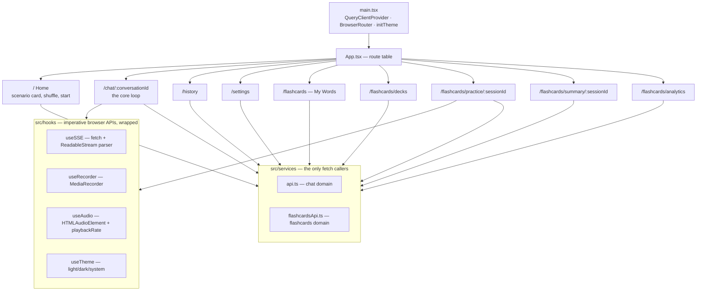
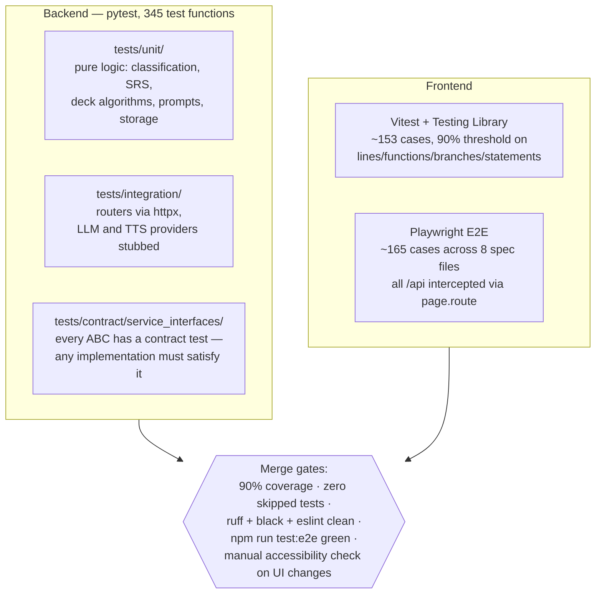
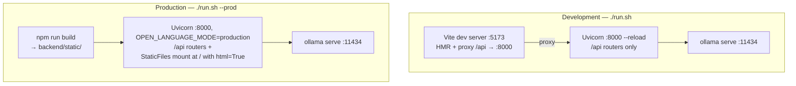

# Open Language — Architecture

**Status:** Living document · **Last updated:** 2026-09-25 · **Audience:** human contributors and LLM agents

This document explains what Open Language is, how it is put together, and — most importantly — **why** it
is put together that way. Where a decision looks unusual, the rationale is stated inline rather than left
for the reader to reverse-engineer.

Companion documents:

| Document | Covers |
|---|---|
| [README.md](../README.md) | Install, run, prerequisites |
| [CLAUDE.md](../CLAUDE.md) | Coding rules enforced on every change |
| [.specify/memory/constitution.md](../.specify/memory/constitution.md) | The governance rules those coding rules derive from |
| [docs/design-system.md](design-system.md) | Visual tokens, component patterns, dark mode, accessibility |
| [specs/](../specs/) | Per-feature spec → plan → tasks artifacts |
| [reference/TRANSCRIPTION_INTEGRATION.md](../reference/TRANSCRIPTION_INTEGRATION.md) | Reference notes on the faster-whisper / CUDA integration |

---

## 1. What this project is

Open Language is a **privacy-first spoken language-practice application, local by default**. A learner
picks a role-play scenario ("buy a train ticket"), speaks or types in their target language, and an AI
partner answers in character — out loud. Along the way the learner can ask for grammar feedback,
translations, alternative phrasings, and word lookups; save unknown words; and later drill those words
with spaced-repetition flashcards.

### The one decision everything else follows from

**Every AI capability sits behind a provider interface, and the default provider for each one runs on
the user's own machine.** By default there is no cloud, no API key, and no account:

- Speech-to-text: `faster-whisper`, loaded in-process — always local
- Language model: `Ollama` serving `llama3.1:8b` on `localhost:11434` — the default. Claude, through the
  learner's own signed-in Claude Code, is an opt-in alternative (feature 004)
- Text-to-speech: `Piper`, loaded in-process from local `.onnx` voice files — always local
- Persistence: a single SQLite file under `~/.open-language/`

**Why local is the default.** Practising a language means saying clumsy, personal, embarrassing things
thousands of times. Shipping that audio to a third party is a real privacy cost, and metered API calls
make a learner ration the exact behaviour the app exists to encourage. A local default removes both
problems for every learner who doesn't choose otherwise — and speech never leaves the machine at all.

**Why it is a default and not a rule.** A local 8B model has limits a learner may reasonably want to
trade away; correction quality is the clearest case (see [Open items](#open-items-and-known-debt)). So
each capability is a swappable provider (constitution Principle VI):

- Feature code depends on an interface (`LLMProvider`, `StructuredLLMProvider`,
  `SessionCapableProvider`, `STTProvider`, `TTSProvider`), never on a concrete provider.
- One registry per capability turns the saved choice into a provider. For the language model that is
  `build_llm_provider()` in `services/llm/registry.py`, and provider ids are listed only in
  `services/llm/catalog.py`.
- A cloud provider is used only once the learner selects it, and selecting it shows what leaves the
  machine. The app never stores or logs credentials: Claude authenticates through Claude Code's own
  sign-in, and the app refuses an API-key login so usage always draws on the learner's plan.
- There is no silent fallback. If the selected provider fails, the learner is told what to do next.

The local default still shapes almost every other choice in this document:

- **No auth, no multi-tenancy, no rate limiting.** One user, one machine, one database file.
- **No "offline mode".** The default stack has no online mode to contrast it with. A learner who picks
  Claude gets a plain-language message when it can't be reached, not a degraded mode.
- **Latency is CPU/GPU-bound, not network-bound** on the default stack. Optimisation effort goes into
  model loading, keeping models loaded between turns, thread offloading, and caching results.
- **Heavy work must leave the event loop.** Whisper, Piper, Ollama, and `claude` subprocess calls are
  blocking. Every one of them is wrapped in `run_in_executor`, because a single slow synthesis would
  otherwise freeze the whole single-process app.
- **Caching is aggressive and permanent.** A TTS clip or an LLM explanation costs seconds of compute, so
  results are written to SQLite or to disk and never recomputed.

---

## 2. System context


```mermaid
flowchart TB
    User(["Learner"])

    subgraph Browser["Browser — localhost:5173 dev / :8000 prod"]
        SPA["React 18 SPA<br/>Vite · React Router · TanStack Query"]
        MIC["MediaRecorder<br/>WebM/Opus capture"]
        AUD["HTMLAudioElement<br/>playback + playbackRate"]
    end

    subgraph Backend["FastAPI — Uvicorn, single process"]
        API["/api routers"]
        SVC["Service layer<br/>behind ABCs"]
    end

    subgraph Local["Local machine only"]
        WHISPER["faster-whisper<br/>in-process, CUDA or CPU"]
        PIPER["Piper TTS<br/>in-process ONNX"]
        OLLAMA["Ollama daemon<br/>llama3.1:8b"]
        FFMPEG["ffmpeg<br/>subprocess"]
        DB[("SQLite<br/>~/.open-language/app.db<br/>WAL mode")]
        CACHE[("TTS cache<br/>~/.open-language/tts_cache/*.wav")]
    end

    User --> SPA
    SPA <--> MIC
    SPA <--> AUD
    SPA -- "fetch + SSE over /api" --> API
    API --> SVC
    SVC --> WHISPER
    SVC --> PIPER
    SVC -- "HTTP localhost:11434" --> OLLAMA
    SVC --> FFMPEG
    SVC --> DB
    SVC --> CACHE

    subgraph OptIn["Opt-in — only while the learner has selected Claude"]
        CC["claude -p subprocess<br/>learner's Claude Code sign-in<br/>no tools · empty workdir"]
        ANTH["Anthropic<br/>billed to the learner's Claude plan"]
    end

    SVC -. "stdin / stdout, text only" .-> CC
    CC -. "HTTPS" .-> ANTH

    style Local fill:#0d948820,stroke:#0d9488
    style Browser fill:#78716c20,stroke:#78716c
    style OptIn fill:#78716c10,stroke:#78716c,stroke-dasharray: 5 5
```

With the default providers nothing in this diagram crosses the machine boundary: the only network call
in the runtime is `localhost:11434` to Ollama. Selecting Claude adds the dashed path. Conversation and
learning-tool text then goes to Anthropic through the learner's own Claude Code; audio never does,
because speech recognition and the voice have no cloud provider.

---

## 3. How this codebase gets built: spec-driven development

This is not a repository where someone opened an editor and started typing. It is built with
**SpecKit v0.3.0**, a spec-driven development (SDD) framework, under a written **constitution**.
Understanding that is a prerequisite to contributing — human or agent.

### The workflow


```mermaid
flowchart LR
    A["/speckit.specify<br/><b>spec.md</b><br/>user stories P1/P2/P3<br/>functional requirements<br/>success criteria"]
    B["/speckit.clarify<br/>ambiguities resolved<br/>answers written back<br/>into spec.md"]
    C["/speckit.plan<br/><b>plan.md + research.md</b><br/>tech decisions with<br/>alternatives rejected"]
    D["/speckit.tasks<br/><b>tasks.md</b><br/>dependency-ordered<br/>exact file paths"]
    E["/speckit.implement<br/>TDD, phase by phase"]
    F["/speckit.checklist<br/>quality gates"]
    G["/speckit.analyze<br/>cross-artifact<br/>consistency"]

    A --> B --> C --> D --> E --> F --> G

    CONST{{"constitution.md<br/>v1.1.0"}}
    CONST -. "gates every phase" .-> C
    CONST -.-> E
    CONST -.-> F

    style CONST fill:#d9770620,stroke:#d97706
```

Every feature leaves a permanent paper trail in `specs/<NNN>-<slug>/`:

```
specs/001-speak-roleplay-chat/
├── spec.md          What and why, in user-facing terms. No technology named.
├── research.md      Every technical decision, its rationale, and what was rejected.
├── plan.md          Technical context + a Constitution Check gate table.
├── data-model.md    Entities, fields, relationships.
├── tasks.md         Dependency-ordered tasks with exact file paths.
├── quickstart.md    How to run/verify the feature.
├── contracts/       API and service-interface contracts, written before code.
└── checklists/      Pre-merge quality validation.
```

**Why keep all this?** Three reasons that matter in practice:

1. **`research.md` is the "why" archive.** When you wonder why the app converts WebM to WAV with an
   ffmpeg subprocess instead of handing bytes to Whisper, the answer is written down with the rejected
   alternatives (`pydub`: slower, same ffmpeg dependency; `soundfile`: cannot transcode). Nobody has to
   re-litigate it.
2. **`spec.md` clarifications are binding decisions.** Ambiguities are resolved once, recorded as Q/A,
   and encoded into requirements. The flashcard classification rules, for example, are not folklore —
   their precedence order was decided in a clarification session and is quoted verbatim in the docstring
   of `app/flashcards/services/classification.py`.
3. **Agents need seeding, not spelunking.** An LLM agent handed this repo can read one feature folder and
   know the intent, the constraints, and the rejected paths, instead of inferring intent from code.

### The constitution and its five principles

[`.specify/memory/constitution.md`](../.specify/memory/constitution.md) (v1.1.0, ratified 2026-03-15) is
the top of the rule hierarchy. It supersedes all other style guides.

| Principle | Practical effect in this codebase |
|---|---|
| **I. Clean Code** | Functions ≤ 20 lines. Names reveal intent — `conversation_repository`, never `conv_repo`. Comments explain *why*. Dead code is deleted, not commented out. |
| **II. SOLID** | Every external dependency sits behind an ABC. Violations must be justified in the plan's Complexity Tracking table. |
| **III. TDD (non-negotiable)** | No production code before a failing test. Red → Green → Refactor. 90% coverage is enforced by `--cov-fail-under=90` in `pyproject.toml` and by Vitest thresholds — the build fails, this is not an honour system. |
| **IV. Simple UI & UX** | One primary action per screen. Immediate feedback. Error messages say what to do next. Accessibility is a quality gate, not polish. |
| **V. Extensibility & Compartmentalization** | Each feature domain has one public interface. No direct cross-module imports. Extension points are declared as abstractions *before* the first concrete implementation. |

**Why a constitution at all?** The domain is open-ended — new languages, new exercise types, new
pedagogies, new local model backends. A project like that dies from accumulated coupling long before it
dies from missing features. The constitution front-loads the discipline that keeps growth *additive*.
Principle V is the load-bearing one: it is the reason the flashcards feature could be added as a whole
new domain in `app/flashcards/` without editing a single line of the chat feature.

---

## 4. Backend architecture

### Layers


```mermaid
flowchart TB
    subgraph L1["Transport — app/routers/, app/flashcards/router.py"]
        R1["scenarios"]:::r
        R2["conversations"]:::r
        R3["chat · SSE"]:::r
        R4["audio · STT/TTS"]:::r
        R5["learning"]:::r
        R6["vocabulary"]:::r
        R7["settings"]:::r
        R8["flashcards"]:::r
        R9["corrections"]:::r
    end

    subgraph L2["Composition — app/services/factory.py"]
        F["FastAPI Depends providers<br/>the ONLY place concretes are constructed"]
    end

    subgraph L3["Contracts — abstract base classes"]
        I1["LLMProvider"]:::i
        I2["STTProvider"]:::i
        I3["TTSProvider"]:::i
        I4["StorageProvider"]:::i
        I5["ScenarioProvider"]:::i
        I6["FlashcardStorageProvider"]:::i
        I7["StructuredLLMProvider"]:::i
        I8["CorrectionStorageProvider"]:::i
        I9["CorrectionEvaluator"]:::i
        I10["CorrectionStrategy"]:::i
        I11["SessionCapableProvider /<br/>ConversationSession"]:::i
    end

    subgraph L4["Implementations"]
        C1["OllamaLLMProvider ·<br/>ClaudeCodeLLMProvider<br/>(via services/llm/registry.py)"]:::c
        C2["WhisperSTTProvider"]:::c
        C3["PiperTTSProvider"]:::c
        C4["SQLiteStorageProvider"]:::c
        C5["StaticScenarioProvider"]:::c
        C6["SQLiteFlashcardStorageProvider"]:::c
        C7["SQLiteCorrectionStorageProvider"]:::c
        C8["Off / Gentle / StrictCorrectionStrategy"]:::c
    end

    subgraph L5["Domain services — pure logic, no I/O where possible"]
        S1["ClassificationEngine"]:::s
        S2["DeckGenerationService"]:::s
        S3["SpacedRepetitionService"]:::s
        S4["SessionService"]:::s
        S5["AnalyticsService"]:::s
        S6["LlmCacheService"]:::s
        S7["prompts/templates.py"]:::s
        S8["LlmCorrectionEvaluator"]:::s
        S9["CorrectionPauseTracker"]:::s
        S10["ConversationEngine<br/>+ session pool"]:::s
    end

    L1 --> L2
    L2 --> L3
    L3 -.->|"implemented by"| L4
    L1 --> L5
    L5 --> L3

    classDef r fill:#0d948815,stroke:#0d9488
    classDef i fill:#d9770615,stroke:#d97706
    classDef c fill:#78716c15,stroke:#78716c
    classDef s fill:#16a34a15,stroke:#16a34a
```

**The rule that shapes this diagram:** routers and domain services depend only on the ABC layer. The only
module allowed to name a concrete class is `factory.py` — and, for language models, the provider registry
it delegates to (`services/llm/registry.py`), where a saved provider id becomes a concrete class. This is Dependency Inversion applied literally,
and it buys three things:

- **Testability.** 323 backend tests run with zero models loaded. A fake `LLMProvider` is ten lines.
- **Swappability.** Replacing Piper with Coqui is one new class plus one line in the factory. Adding a
  language-model provider is a catalogue entry, a registry builder, and a session class — which is how
  Claude arrived in 004. No router changes.
- **Startup cost control.** Concrete providers are imported *inside* the factory functions, not at module
  top level, so importing a router does not drag in `faster_whisper` or `piper`.

### Dependency injection wiring


```mermaid
flowchart LR
    DB["get_db<br/>SQLAlchemy Session"] --> ST["get_storage<br/>SQLiteStorageProvider"]
    DB --> FST["get_flashcard_storage<br/>SQLiteFlashcardStorageProvider"]
    DB --> CST["get_correction_storage<br/>SQLiteCorrectionStorageProvider"]
    ST --> AS["get_app_settings<br/>AppSettingsRecord from DB"]
    AS --> LLM["get_llm / get_session_provider<br/>build_llm_provider(provider, model, effort)"]
    AS --> TTS["get_tts<br/>voice = settings.tts_voice"]
    AS --> STT["get_stt<br/>model = settings.whisper_model"]
    AS --> SLLM["get_structured_llm<br/>constrained JSON output"]
    AS --> CS["get_correction_strategy<br/>mode = settings.correction_mode"]
    SLLM --> CS
    CST --> CS
    SC["get_scenario_provider<br/>lru_cache singleton"]

    ENG["get_conversation_engine<br/>lru_cache singleton"]
    LLM --> EP(["router endpoint"])
    ENG --> EP
    TTS --> EP
    STT --> EP
    ST --> EP
    FST --> EP
    SC --> EP

    style AS fill:#d9770620,stroke:#d97706
```

Note the chain through `get_app_settings`. **Providers are built per-request from settings stored in the
database, not from process-level configuration.** That is what satisfies SC-005 from the spec — "a new
LLM model selected in settings takes effect on the next message without an application restart." There is
no reload, no restart, no cache to bust: the next request simply constructs a provider with the new model
name.

Two deliberate exceptions to per-request construction:

- `_stt_providers` is a module-level dict keyed by Whisper model size. Whisper model loading costs
  seconds; rebuilding it per request would be unusable. Changing the model in Settings loads the new one
  once and keeps both resident.
- `_get_scenario_provider` is `lru_cache`d because `StaticScenarioProvider` holds `_last_id` state to
  guarantee the "never the same scenario twice in a row" requirement (FR-003).

### Configuration

`app/config.py` uses `pydantic-settings` with the `OPEN_LANGUAGE_` prefix, reading `backend/.env`.
A `field_validator` runs `expanduser()` on path settings so `~/...` in `.env` resolves correctly.

There are **two tiers of configuration**, and the distinction is intentional:

| Tier | Where | Changes | Examples |
|---|---|---|---|
| Deployment config | `.env` → `Settings` | Requires restart | db path, voice directory, Ollama URL, host/port, Whisper device |
| User preferences | `app_settings` table → `AppSettingsRecord` | Live, next request | LLM model, TTS voice, Whisper model size, target/native language, suggestion count |

Anything a learner would plausibly want to change mid-session lives in the database.

### Database and migrations

`app/database.py` creates one engine with two PRAGMAs applied on every connect:

- `journal_mode=WAL` — lets the history screen read while a message write is in flight. Chosen in
  research Decision 5 over async SQLAlchemy, which adds complexity for no benefit at single-user scale.
- `foreign_keys=ON` — SQLite disables FK enforcement by default; the cascade rules below only work
  because this is switched on explicitly.

Migrations are deliberately primitive. There is no Alembic:

```python
Base.metadata.create_all(bind=_engine)   # new tables appear automatically
_migrate_db()                            # ALTER TABLE ADD COLUMN, idempotent by try/except
```

**Why no migration tool?** Research Decision 7: the database is a single file on one user's laptop, all
changes so far have been purely additive (new tables, new nullable/defaulted columns), and there is no
production fleet to coordinate. `_add_column_if_missing()` swallows the `OperationalError` that SQLite
raises when the column already exists.

`_add_column_if_missing()` tolerates exactly one failure — SQLite's `duplicate column name` — and
re-raises everything else, so a missing table or a malformed definition surfaces instead of leaving the
schema quietly wrong.

> **This is technical debt with a known expiry date.** It still cannot express a rename, a type change, a
> data backfill, or a rollback. The moment a change is not purely additive, this needs to become Alembic.
> Flagged here so nobody discovers it mid-incident.

---

## 5. Data model


```mermaid
erDiagram
    CONVERSATIONS ||--o{ MESSAGES : "has"
    CONVERSATIONS ||--o| CONVERSATION_CORRECTION_STATE : "paused by"
    MESSAGES ||--o{ LEARNING_TOOL_RESULTS : "caches"
    MESSAGES ||--o{ MESSAGE_FEEDBACK : "annotated by"
    CONVERSATIONS ||--o{ VOCABULARY_ITEMS : "sourced from"
    VOCABULARY_ITEMS ||--o{ DECK_CARDS : "appears as"
    VOCABULARY_ITEMS ||--o{ CARD_RESULTS : "rated in"
    VOCABULARY_ITEMS ||--o{ FLASHCARD_RATING_HISTORY : "rolling window"
    VOCABULARY_ITEMS ||--o| SPACED_REPETITION_SCHEDULE : "scheduled by"
    VOCABULARY_ITEMS ||--o{ WORD_LLM_CACHE : "explained by"
    DECKS ||--o{ DECK_CARDS : "contains"
    DECKS ||--o{ PRACTICE_SESSIONS : "practised in"
    PRACTICE_SESSIONS ||--o{ CARD_RESULTS : "records"
    PRACTICE_SESSIONS ||--o{ FLASHCARD_RATING_HISTORY : "produces"
    PRACTICE_SESSIONS ||--o| SESSION_CLASSIFICATION_SNAPSHOTS : "snapshots"

    CONVERSATIONS {
        int id PK
        string scenario_id
        string scenario_title
        string target_language
        string native_language
        enum status "active|completed"
        datetime started_at
        datetime ended_at
        string llm_model
        text custom_prompt "null unless user-authored scenario"
    }
    MESSAGES {
        int id PK
        int conversation_id FK "CASCADE"
        enum role "user|assistant"
        text content
        enum input_source "voice|keyboard|null"
        datetime created_at
        string tts_audio_path "cached wav"
    }
    LEARNING_TOOL_RESULTS {
        int id PK
        int message_id FK "CASCADE"
        enum tool_type "grammar|translation|alternative_phrasing|word_lookup"
        string input_selection
        text result
        datetime created_at
    }
    VOCABULARY_ITEMS {
        int id PK
        string word "UNIQUE with target_language"
        string translation
        string target_language
        string native_language
        int source_conversation_id FK "SET NULL"
        datetime saved_at
        string classification "not_practiced|difficult|almost_learned|learned"
        bool manual_override
        string tts_cache_path
    }
    DECKS {
        int id PK
        string name
        string practice_mode "recall|listen|produce|fill_blank"
        string algorithm
        int requested_size
        datetime created_at
        datetime last_practiced_at
    }
    DECK_CARDS {
        int id PK
        int deck_id FK "CASCADE"
        int vocabulary_item_id FK "SET NULL"
        int position "UNIQUE per deck"
        string fill_blank_sentence "LLM-generated"
    }
    PRACTICE_SESSIONS {
        int id PK
        int deck_id FK "SET NULL — survives deck deletion"
        string practice_mode
        string algorithm
        datetime started_at
        datetime ended_at
        int total_cards
        int cards_reviewed
        int knew_it_count
        int guessed_count
        int didnt_know_count
        bool completed
    }
    CARD_RESULTS {
        int id PK
        int session_id FK "CASCADE"
        int vocabulary_item_id FK "SET NULL — survives word deletion"
        string rating "knew_it|guessed|didnt_know"
        string response_type
        text user_response
        datetime rated_at
    }
    FLASHCARD_RATING_HISTORY {
        int id PK
        int vocabulary_item_id FK "CASCADE"
        string rating
        datetime rated_at
        int session_id FK "CASCADE"
    }
    SPACED_REPETITION_SCHEDULE {
        int id PK
        int vocabulary_item_id FK "CASCADE, UNIQUE"
        int interval_stage
        datetime last_practiced_at
        datetime next_due_at
    }
    WORD_LLM_CACHE {
        int id PK
        int vocabulary_item_id FK "CASCADE"
        string cache_type "meanings|usage|phrases|similar"
        string language
        text content
        datetime generated_at
    }
    SESSION_CLASSIFICATION_SNAPSHOTS {
        int id PK
        int session_id FK "CASCADE"
        datetime snapshotted_at
        int not_practiced_count
        int difficult_count
        int almost_learned_count
        int learned_count
    }
```

### Why the FK actions differ

The `ondelete` choices are not incidental — each encodes a product decision from a spec clarification.

- **`CASCADE`** where the child is meaningless without the parent: messages under a conversation,
  tool results under a message, rating history under a word.
- **`SET NULL`** where history must outlive its subject. Deleting a deck keeps its `practice_sessions`
  as orphans; deleting a word keeps its `card_results`. Both were explicit clarifications: *"allow
  deletion; historical records are retained as orphaned records so analytics remain intact."* A learner
  cleaning up their word list must not silently rewrite their own progress charts.

### Why some things are cached in tables

Three tables exist purely as caches, and all three exist because local inference is slow:

- `learning_tool_results` — unique on `(message_id, tool_type, input_selection)`, populated through a
  `get_or_create_learning_result(..., compute)` callback. Re-opening a grammar explanation you read five
  minutes ago is instant instead of a fresh LLM round-trip. The API returns `cached: true/false` so the UI
  can tell the truth about what just happened.
- `word_llm_cache` — unique on `(word, cache_type, language)`, holding LLM-generated meanings, usage
  examples, phrases, and similar words. Target: <10s first fetch, <1s cached.
- `messages.tts_audio_path` / `vocabulary_items.tts_cache_path` — pointers into
  `~/.open-language/tts_cache/`. Audio synthesis is re-used forever; the row stores the path, the disk
  stores the bytes.

### The `snapshots` table, and why aggregation is not enough

`session_classification_snapshots` stores the *distribution* of word classifications at the end of every
session. It is denormalised on purpose: classification is a mutable field on `vocabulary_items`, so
"what did my progress look like three weeks ago?" is unanswerable from current state. Writing a snapshot
at each session end is the only way to draw the classification-over-time chart honestly.

---

## 6. Key runtime flows

### 6.1 A conversation turn (voice input → spoken reply)

```mermaid
sequenceDiagram
    autonumber
    actor U as Learner
    participant FE as React · Chat.tsx
    participant REC as useRecorder
    participant AUD as /api/audio/transcribe
    participant FF as ffmpeg
    participant W as faster-whisper
    participant CH as POST /api/chat/:id/message
    participant DB as SQLite
    participant E as ConversationEngine
    participant O as LLM provider (Ollama by default)
    participant P as Piper

    U->>FE: tap record
    FE->>REC: startRecording
    REC->>REC: MediaRecorder, audio/webm with opus codec
    U->>FE: tap stop
    REC-->>FE: Blob
    FE->>AUD: POST multipart + language hint
    AUD->>FF: subprocess → 16kHz mono PCM WAV
    FF-->>AUD: temp wav path
    AUD->>W: run_in_executor(transcribe)
    Note over W: CUDA attempted first;<br/>on any cuda/cublas/cudnn error<br/>the model reloads on CPU and retries
    W-->>AUD: text + detected_language
    AUD-->>FE: {text}
    Note over AUD: temp wav deleted in finally

    FE->>CH: POST {content, input_source:"voice"}
    activate CH
    CH->>DB: save user message
    CH-->>FE: SSE user_message_saved
    CH->>DB: load full history
    CH->>E: run_in_executor(stream_turn, TurnRequest)
    E->>O: reply(pending turns) on the live session, or rebuild it from history
    O-->>E: tokens
    E-->>CH: tokens
    loop each token
        CH-->>FE: SSE data: {token}
    end
    CH->>DB: save assistant message
    CH->>E: acknowledge(saved message id)
    CH->>P: run_in_executor(synthesize) — fire and forget
    CH-->>FE: SSE data: {done, message_id}
    deactivate CH
    P->>DB: set tts_audio_path
    FE->>FE: audio element src = /api/audio/tts/:message_id
    U->>FE: optional: replay at 0.6× playbackRate
```

Points worth internalising:

- **Every message is persisted the instant it exists** (FR-024). The user message is written *before* the
  LLM is called, so a crash mid-generation loses at most the AI's half of one turn.
- **Saved history is the source of truth; a session is only a cache of it.** Every turn hands the engine
  the whole saved history. The engine reuses the conversation's live session only while the session's
  turns line up with that history, and rebuilds it otherwise (see *Conversation sessions* below).
- **TTS is fire-and-forget.** `loop.run_in_executor(None, _synthesize)` is launched without `await`, so the
  `done` event reaches the browser immediately. The frontend then requests `/api/audio/tts/{id}`, which
  serves the cached file if synthesis finished or synthesises on demand if it did not. The endpoint is
  idempotent, which is what makes the race harmless.
- **Slow replay is a client-side `playbackRate`, never a re-synthesis.** Research Decision 2: Piper has no
  speed parameter, and server-side time-stretching would burn CPU for a trivial UX affordance.
- **SSE over WebSocket**, and `fetch` + `ReadableStream` over `EventSource`. Turn-taking is strictly
  unidirectional, so WebSocket bidirectionality is wasted complexity; `EventSource` was rejected because
  it cannot send a POST body and the conversation history has to go up with the request.

> **Accepted decision — batched tokens, streamed transport.** `chat.py` runs
> `await loop.run_in_executor(None, turn.collect)`, where `collect` does
> `list(engine.stream_turn(...))`. That materialises the whole response before the first SSE frame, then
> replays the tokens instantly, so the "typing" effect is cosmetic rather than real. This is a deliberate
> trade: bridging a sync generator running in an executor thread to an async generator needs a queue and
> its own cancellation handling, and on a local model the whole response arrives in a couple of seconds
> anyway. The transport, the client parser, and `LLMProvider.chat_stream` all support true incremental
> streaming already, so this stays a one-function change whenever the latency starts to matter.
> Conversation sessions (004) change where the tokens come from, not how they reach the screen: delivery
> is still batched, by the learner's decision.

#### Conversation sessions

Feature 004 keeps each conversation's language model "warm" between turns. Roleplay turns, the opening
line, and expression-helper turns all go through one `ConversationEngine`
(`app/services/conversation/`), which owns "produce the next reply for this conversation". Routers hand
it a `TurnRequest` — the key, the standing system prompt, the saved history, and any per-turn guidance —
and relay the tokens. They never build message lists or touch a provider directly, so adding a provider
changes no router.

- **The pool.** A `ConversationSessionPool`, one per process, holds at most **3** live sessions (LRU) and
  closes any session idle for **30 minutes**. Expiry is checked on every access, and a lifespan task
  (`run_session_reaper`) sweeps every **60 s**, so an untouched app holds no idle processes. Completing a
  conversation closes its session, and shutdown closes them all, so no `claude` process outlives the
  backend.
- **Source of truth.** A session records the saved ids of the turns it has taken in. A turn reuses the
  session only when those ids are a prefix of the saved history and every remaining turn is the
  learner's (a Strict-mode pause plus its retry arrive together). A different provider, model, effort,
  or standing prompt, a deleted or reordered message, or a reply that was never saved all force a
  rebuild from history. The reuse/rebuild decision is the pure function `plan_session_use()`.
- **One reply per rebuild.** Rebuilding costs exactly the reply the learner is waiting for, however long
  the history (FR-S05).
- **Locking and retries.** A per-conversation lock is held for the whole turn, so turns of one
  conversation never interleave while different conversations run side by side. A session-level
  failure (a process that died, unreadable output, a timeout) closes the session and retries once on a
  rebuilt one; an account-level failure (not signed in, usage limit, unknown model) is reported at once.
  Each attempt's reply is collected in full before it is returned (delivery is batched anyway), so a
  process that dies partway through a reply is retried too, and the retry replaces the partial text
  instead of splicing onto it.
- **Ollama.** Its chat API is stateless, so an Ollama session keeps the turns in memory and resends them.
  What it buys is `keep_alive`: while any conversation session holds a model, every request for that
  model, one-shot learning-tool calls included, keeps it loaded for the idle TTL. That removes the
  4–49 s reload a learner used to pay after five quiet minutes. Ollama resets a model's unload timer on
  every request, so a one-shot call without the keep-alive would undo it. When the model's last session
  closes, an empty preload with no `keep_alive` hands it back to Ollama's own policy
  (`services/llm/ollama_residency.py`). Per-turn guidance (Gentle mode's recast instruction) is
  appended to the system prompt for that call only, byte-identical to before.
- **Claude.** A Claude session is one long-lived `claude -p --input-format stream-json` process per
  conversation. Each turn writes one line to stdin and reads until that turn's result, so earlier turns
  are never re-processed (later turns drop from 1.5–2.4 s to 0.7–0.8 s). Guidance travels inside the
  turn's own message as a `<turn_guidance>` block that the standing prompt scopes to that reply. Its
  stderr goes to `~/.open-language/claude-logs/`, never to the empty working directory.
- **Warm-up.** Opening an existing conversation calls `POST /api/chat/{id}/session`, which builds the
  session in the background (an empty Ollama preload, or a Claude process waiting on stdin) without
  generating anything. The call is fire-and-forget: the first real turn reports any problem.

### 6.2 Prompt construction

All prompts live in one module, `app/prompts/templates.py`, as pure string-building functions with no I/O.
That makes them unit-testable (`tests/unit/prompts/test_templates.py`) and keeps prompt engineering out of
the routers.


```mermaid
flowchart LR
    subgraph inputs["Runtime inputs"]
        SC["scenario title +<br/>description +<br/>ai_context_prompt"]
        CP["custom_prompt<br/>if user-authored"]
        LG["target_language<br/>native_language"]
        H["message history"]
    end

    subgraph templates["prompts/templates.py"]
        T1["build_roleplay_system_prompt"]
        T2["build_grammar_prompt"]
        T3["build_translation_prompt"]
        T4["build_phrasing_prompt"]
        T5["build_word_lookup_prompt"]
        T6["build_suggestion_prompt"]
        T7["build_helper_system_prompt"]
        T8["build_custom_title_prompt"]
    end

    SC --> T1
    CP --> T1
    LG --> T1 & T2 & T3 & T4 & T5 & T6 & T7
    H --> T6
    templates --> OLLAMA["OllamaLLMProvider"]
```

Two prompt-design decisions carry real product weight:

- **Language enforcement is done in the prompt, not with a language-detection library.** The role-play
  system prompt opens with an emphatic `CRITICAL LANGUAGE RULE` block forbidding *any* native-language
  token. This directly implements FR-009 and its clarification: redirect only when the learner's *entire*
  message is in the wrong language, never for isolated loanwords. A detection library would have to
  re-implement that nuance; the model already understands it.
- **The helper and the suggestion prompts explicitly forbid continuing the role-play.** These features run
  on the same model and the same conversation text, so without `Do NOT continue any roleplay` the model
  drifts back into character and answers as the ticket agent instead of as a tutor.

#### Conversation level (feature 005)

The learner-wide **conversation level** (Beginner ≈ A1, Elementary ≈ A2, Intermediate ≈ B1, Natural) caps
how complex the target-language text is. It lives in its own domain module,
`app/conversation_levels/`, which owns no tables and no router and exports exactly five names:
`ConversationLevel`, `DEFAULT_CONVERSATION_LEVEL`, `LEVEL_CATALOG`, `with_partner_speech_rules` and
`with_learner_text_rules`. Every limit (sentences per reply, words per sentence, tenses, vocabulary band,
idioms, questions) is a named field of one `SpeechLimits` value in the catalogue.

- **Composition, not modification.** `templates.py` is untouched. The routers wrap its output:
  `with_partner_speech_rules(build_roleplay_system_prompt(...), level)` for the roleplay standing prompt
  (opening, message and warm-up alike), and `with_learner_text_rules(...)` around the suggestion,
  phrasing and helper prompts. The rules block is appended *after* the prompt, so the
  `CRITICAL LANGUAGE RULE` stays first. Grammar, translation and word lookup are native-language output
  and are never wrapped.
- **Natural is byte-identical to before.** Natural has no limits (`limits=None`), and both renderers then
  return the prompt unchanged, so existing learners see exactly the pre-005 behaviour. A unit test pins it.
- **A level change needs no engine code.** The level is part of the standing prompt, and the session
  fingerprint already includes a digest of that prompt, so the next roleplay or helper turn after a change
  rebuilds its session from saved history (see *Conversation sessions* above). A reply already streaming
  finishes at the level it started with.
- **Phrasings are cached per level.** `learning_tool_results.input_selection` for an alternative phrasing
  is the bare message content at Natural (so rows written before 005 stay valid) and
  `"[level:<id>] <content>"` otherwise. No schema change.
- **Two controls, one setting.** Settings has a radio group; the chat header has a compact `<select>` that
  saves on change with a level-only `PUT /api/settings`, which skips the provider availability check.

### 6.3 Corrective feedback: one seam, three modes

Feature 003 adds grammar correction during practice. The learner picks a mode in Settings —
**Off**, **Gentle**, or **Strict** — and it applies to every conversation from their next message on.

The whole feature hangs off a single decision object. `CorrectionStrategy.plan_turn(context)` returns a
frozen `TurnPlan`, and the chat router acts on that plan **identically regardless of which strategy
produced it**:

```text
TurnPlan(
    feedback: tuple[FeedbackDraft, ...]   # notes to persist, 0..2
    generate_reply: bool                  # False only for a flagged Strict turn
    reply_prompt_suffix: str | None       # the Gentle recast instruction
)
```

`build_correction_strategy(mode, evaluator, storage)` in `app/corrections/__init__.py` is the **only**
place in the codebase where a mode string becomes behaviour. No router, service, or component branches
on the mode again. An unrecognised stored value falls back to Off, so a bad row can never stop a
conversation working.

| Mode | Evaluator call | Reply generated? | What the learner sees |
|---|---|---|---|
| Off | none | yes | nothing new — byte-identical to the pre-feature stream |
| Gentle | yes | yes, same turn | the character restates the corrected form in its own words |
| Strict | yes | **no**, when a mistake is found | a correction note, and the scenario waits for a retry |

**Why evaluate before generating.** FR-016 forbids a character reply for a flagged Strict turn "whether
shown, withheld, or stored". The decision not to generate must therefore be made *before* any tokens
exist. Gentle reuses the same evaluator so there is one detection path, not two.

**The cost, and how it is paid.** Gentle and Strict run a second LLM call per turn. Three things keep
that honest rather than mysterious: the call is wrapped in `asyncio.wait_for` with a configurable
`correction_timeout_seconds` (8 s default); a `checking` status line appears under the learner's message
so the wait is legible; and the Settings control states plainly that a slow check is skipped so the
conversation continues.

**Failing open is the whole resilience story.** Timeout, `LLMError`, and unparseable model output all
produce the same outcome: an empty plan, an ordinary reply, no error surfaced, a `warning` logged. A
missed correction costs one learning moment; a blocked turn costs the conversation. The SSE stream for a
failed evaluation is asserted to be identical to the Off-mode stream.


```mermaid
flowchart TB
    M["learner message"] --> SAVE["save user message<br/>emit user_message_saved"]
    SAVE --> PLAN{"strategy.plan_turn<br/>under wait_for(8s)"}
    PLAN -->|"timeout / LLMError"| NULL["empty plan<br/>log warning"]
    PLAN -->|"plan"| FB{"feedback?"}
    NULL --> FB
    FB -->|"yes, non-gentle"| EMIT["emit feedback frame"]
    FB -->|"no"| REPLY
    EMIT --> GEN{"generate_reply?"}
    GEN -->|"false"| DONE["done · message_id: null<br/>no assistant row, no TTS"]
    GEN -->|"true"| REPLY["stream reply<br/>+ reply_prompt_suffix"]
    REPLY --> DONE2["done · message_id: N"]

    style NULL fill:#d9770620,stroke:#d97706
    style DONE fill:#0d948820,stroke:#0d9488
```

**Two tables, both owned by the corrections module** (`app/corrections/models.py`), created by
`create_all()` like the flashcard tables:

- **`message_feedback`** — one app note attached to one learner message, discriminated by `kind`
  (`correction` | `repeat_request`). Insert-only: no code path rewrites a row, which is what makes FR-004
  ("changing the mode must not alter feedback already in the transcript") true structurally rather than
  by convention. At most two corrections per message, ordered by `rank`.
- **`conversation_correction_state`** — the Strict pause, keyed one-to-one on `conversation_id`. Holds
  `consecutive_corrected_attempts` and `awaiting_clarification`. `awaiting_retry` is **derived, never
  stored**, so it cannot disagree with the counters it comes from.

**The pause cannot deadlock.** `CorrectionPauseTracker` counts *attempts*, not matching errors. After two
consecutive corrected attempts the next message is answered whatever it contains — including a brand-new
mistake. That makes "the learner can never be trapped" a structural property, not a probabilistic one.

**Correction text can never be spoken.** `GET /audio/tts/{id}` synthesises `messages.content`, and
feedback lives in a separate table with no message id of its own. A flagged Strict turn ends with
`done · message_id: null`, so the client has nothing to request audio for. There is no code path from a
note to Piper.

**Transcription confidence gates the whole thing.** `app/services/stt/confidence.py` aggregates
per-segment Whisper signals into one number: drop segments carrying no speech, force low confidence on a
repetition loop, then take the **token-weighted** mean of `avg_logprob` (it is already a per-token mean,
so token count is the correct weight) and exponentiate. Three states are stored and must not be
collapsed:

| Stored | Meaning | Corrected? |
|---|---|---|
| `NULL` | no confidence information — typed input | **yes**, evaluated normally |
| `0.0` | text present, every segment read as silence | no — hallucination-on-silence |
| `< 0.55` | genuinely unclear speech | no |

The `NULL` row is load-bearing: typed input has no confidence and must never be gated. The rule is
`confidence is not None and confidence < threshold`, so `NULL` falls through and `0.0` does not. A
confidence supplied alongside `input_source="keyboard"` is ignored and stored as `NULL` — the value is
client-supplied, and this closes the only way it could be misused.

### 6.4 The "no shortcuts" pedagogy, expressed in architecture

Suggested responses and the expression helper are deliberately **read-only**. There is no tap-to-insert,
no copy-to-input, no send button. From FR-020 and FR-023, and from the clarification session:

> *"Neither — suggestions and expression-helper responses are read-only reference text; the user must
> speak or type them manually to reinforce active production."*

This is friction on purpose. Recognition is not production; a learner who taps "send" on a generated
sentence has practised nothing. The expression helper also keeps its own conversation thread
(`_helper_sessions`, keyed by a client-generated session id) so that asking "how do I say X?" never
pollutes the role-play context.

Helper threads live in `HelperSessionStore` ([helper_sessions.py](../backend/app/services/helper_sessions.py)),
injected through `factory.get_helper_sessions()`. They are the one piece of conversational state not in
SQLite — deliberately, because a throwaway "how do I say X?" lookup is not learning history worth keeping.
The store is bounded rather than unbounded: least-recently-used eviction past 50 threads and a 2-hour idle
expiry, so a long-running process cannot accumulate them without limit.

### 6.5 Flashcards: the learning loop


```mermaid
flowchart TB
    A["Chat: learner selects a word,<br/>looks it up, taps Save"] --> B[("vocabulary_items<br/>classification = not_practiced")]
    B --> C["My Words: browse, filter,<br/>search, manually reclassify"]
    C --> D["Configure deck:<br/>mode + algorithm + size"]
    D --> E{"SRS filter"}
    E -->|"Learned and next_due_at in future"| X["excluded"]
    E -->|"otherwise"| F["DeckGenerationService<br/>Strategy pattern"]
    F --> G[("decks + deck_cards")]
    G --> H["Practice session"]
    H --> I["Per card: prompt → attempt →<br/>flip → self-rate"]
    I --> J[("card_results +<br/>flashcard_rating_history")]
    J -->|"more cards"| I
    I --> K["End session"]
    K --> L["SessionService.end_session"]
    L --> M["ClassificationEngine.recalculate<br/>over last 5 ratings per word"]
    M --> N["SpacedRepetitionService<br/>for newly Learned words"]
    N --> O[("classification snapshot")]
    O --> P["Summary: score, streak,<br/>words needing work,<br/>LLM encouragement"]
    P -->|"practise the misses"| Q["missed-deck generated<br/>from this session"]
    Q --> H
    O --> R["Analytics dashboard"]

    style E fill:#d9770620,stroke:#d97706
    style M fill:#0d948820,stroke:#0d9488
```

**Four practice modes**, each testing a different retrieval direction:

| Mode | Prompt shown | What it trains |
|---|---|---|
| `recall` | Target-language word | Comprehension (L2 → L1) |
| `listen` | Audio only, no text | Listening comprehension |
| `produce` | Native-language word | Production (L1 → L2) — the hard direction |
| `fill_blank` | LLM-generated sentence with `___` | Contextual use, not isolated lookup |

`fill_blank` sentences are generated once at deck-build time and stored in `deck_cards.fill_blank_sentence`
via `LlmCacheService`, so a deck is never blocked on the model mid-session.

**Deck generation uses the Strategy pattern** (`deck_generation.py`) — a `_STRATEGIES` registry mapping
algorithm names to objects satisfying an `AlgorithmStrategy` Protocol. This is Open/Closed made concrete:
a new algorithm is a new class plus a registry entry, with no edit to any existing strategy. Unknown
algorithm names fall back to random selection rather than raising, so a stale deck config cannot brick the
screen.

### 6.6 Classification: a pure function with a documented precedence order

`app/flashcards/services/classification.py` has **no I/O at all**. It takes a list of rating strings
(most recent first, max five) plus the current classification, and returns the new classification. That
purity is why it can carry the most intricate business rules in the app while remaining trivially testable.


```mermaid
stateDiagram-v2
    [*] --> NotPracticed: word saved from chat

    NotPracticed --> Learned: 3+ consecutive Knew It
    NotPracticed --> Difficult: 2+ Didn't Know in last 5
    NotPracticed --> AlmostLearned: 3+ of last 5 positive, ≥1 Guessed

    AlmostLearned --> Learned: 3+ consecutive Knew It
    AlmostLearned --> Difficult: 2+ Didn't Know in last 5

    Difficult --> AlmostLearned: 3+ of last 5 positive, ≥1 Guessed
    Difficult --> Learned: 3+ consecutive Knew It

    Learned --> Difficult: most recent is Didn't Know
    Learned --> NotPracticed: no pattern matches

    note right of Learned
        Learned words are hidden from new
        decks until next_due_at passes
    end note
```

Rules are evaluated in strict priority order, and the order itself was a clarification decision:

1. Three consecutive `knew_it` at the head of the window → **Learned**.
   *Clarified: "Streak wins — 3 consecutive Knew Its always promotes to Learned, overriding any Didn't
   Knows in the same window."*
2. Currently Learned and the newest rating is `didnt_know` → **Difficult** (regression).
3. Two or more `didnt_know` in the last five → **Difficult**.
4. At least three of the last five are `guessed` or `knew_it`, with at least one `guessed` →
   **Almost Learned**.
5. Otherwise, hold.

**`manual_override` and why it is temporary.** A learner can force a classification from the word list.
That sets `manual_override = true`, which makes the next recalculation *skip* the word — and then clear
the flag. The override survives exactly one session, after which the automatic system resumes. The
rationale: a manual correction is a one-off nudge, not a permanent opt-out, and a word silently frozen
forever would quietly corrupt the learner's own analytics.

### 6.7 Spaced repetition

`SpacedRepetitionService` advances a word along a fixed ladder of intervals, in days:

```
stage:     1     2     3     4      5      6      7
days:      1     3     7    14     30     60    120
```

| Rating | Effect |
|---|---|
| `knew_it` | advance one stage, capped at 7 |
| `guessed` | hold the current stage |
| `didnt_know` | reset to stage 1 |

*Clarified: "Knew It advances; Guessed Correctly holds the current stage; Didn't Know resets."*

Scheduling applies only to words that have reached **Learned**. Everything below that classification is
still in acquisition and is eligible for every deck. Once Learned, `_filter_srs_eligible()` in the router
removes the word from new decks until `next_due_at` has passed — which is what stops decks from being
clogged with words the learner already owns.

`update_schedule()` takes its storage as a typed `FlashcardStorageProvider` parameter, so a call that
does not match the interface is a type error rather than a runtime surprise — this method previously
passed an argument the interface does not accept and raised `TypeError` whenever a word was promoted to
Learned, because the unit tests covered only the two pure methods and never exercised the persistence
path. `TestUpdateSchedule` now covers it.

---

## 7. Frontend architecture

### Structure


```mermaid
flowchart TB
    M["main.tsx<br/>QueryClientProvider · BrowserRouter · initTheme"]
    M --> APP["App.tsx — route table"]

    APP --> H["/ Home<br/>scenario card, shuffle, start"]
    APP --> C["/chat/:conversationId<br/>the core loop"]
    APP --> HI["/history"]
    APP --> S["/settings"]
    APP --> FW["/flashcards — My Words"]
    APP --> FD["/flashcards/decks"]
    APP --> FP["/flashcards/practice/:sessionId"]
    APP --> FS["/flashcards/summary/:sessionId"]
    APP --> FA["/flashcards/analytics"]

    subgraph hooks["src/hooks — imperative browser APIs, wrapped"]
        HK1["useSSE — fetch + ReadableStream parser"]
        HK2["useRecorder — MediaRecorder"]
        HK3["useAudio — HTMLAudioElement + playbackRate"]
        HK4["useTheme — light/dark/system"]
    end

    subgraph services["src/services — the only fetch callers"]
        SV1["api.ts — chat domain"]
        SV2["flashcardsApi.ts — flashcards domain"]
    end

    C --> hooks
    FP --> hooks
    H & C & HI & S & FW & FD & FP & FS & FA --> services
```

### State: three kinds, three mechanisms

The most important frontend decision is that there is **no global state library** — no Redux, no Zustand.
State is classified by lifetime and each kind gets the cheapest tool that fits:

| Kind | Mechanism | Why |
|---|---|---|
| Server state | TanStack Query (`staleTime: 30s`, `retry: 1`) | Caching, invalidation, and loading states are its whole job. |
| Streaming conversation state | `ConversationProvider` context | Tokens arrive dozens of times per second and mutate the last message in place — Query is the wrong shape for this. |
| Ephemeral session state | `useState` / `useReducer` in the component | Current card index, timer, accumulated ratings. Research Decision 8: *"this is not server state — it lives in the component tree until session end, when it is flushed to the API."* |

The `useSSE` hook holds an `AbortController` so navigating away mid-stream cancels the request cleanly, and
it discriminates `AbortError` from genuine failures so cancelling never surfaces an error banner.

### Design system

All UI work is bound by [docs/design-system.md](design-system.md). The short version — a *warm minimal*
language: warm stone neutrals plus a teal primary, Plus Jakarta Sans, generous line heights for reading.
The rules that get violated most often, and why they exist:

- **Never hardcode a hex colour.** Use the CSS custom-property tokens in `index.css`.
- **Never hardcode `#fff` for text on a primary background** — use `var(--color-text-on-primary)`. In dark
  mode the primary is *light* teal and needs *dark* text; a hardcoded white is invisible.
- **Navigation text uses `--color-text`, not `--color-primary`** — the latter produced a blue-on-dark-blue
  contrast failure in dark mode.
- Cards use `--radius-lg`; shadows use the warm-tinted `--shadow-sm/md/lg`; back links use
  `--color-text-muted`.

Dark mode is driven by a `data-theme` attribute on `<html>`, applied by `initTheme()` before React mounts
so there is no flash of the wrong theme. Three states: `light`, `dark`, and `system` (attribute removed,
`prefers-color-scheme` decides).

---

## 8. Testing strategy

TDD is constitutionally mandatory: **no production code exists before a failing test for it**. The
enforcement is mechanical, not cultural — coverage thresholds fail the build.


```mermaid
flowchart TB
    subgraph BE["Backend — pytest, 345 test functions"]
        B1["tests/unit/<br/>pure logic: classification, SRS,<br/>deck algorithms, prompts, storage"]
        B2["tests/integration/<br/>routers via httpx,<br/>LLM and TTS providers stubbed"]
        B3["tests/contract/service_interfaces/<br/>every ABC has a contract test —<br/>any implementation must satisfy it"]
    end

    subgraph FE["Frontend"]
        F1["Vitest + Testing Library<br/>~153 cases, 90% threshold on<br/>lines/functions/branches/statements"]
        F2["Playwright E2E<br/>~165 cases across 8 spec files<br/>all /api intercepted via page.route"]
    end

    GATE{{"Merge gates:<br/>90% coverage · zero skipped tests ·<br/>ruff + black + eslint clean ·<br/>npm run test:e2e green ·<br/>manual accessibility check on UI changes"}}

    BE --> GATE
    FE --> GATE
```

Two conventions deserve emphasis:

- **Contract tests are the guarantee behind the ABC layer.** `tests/contract/service_interfaces/` tests the
  *interface*, not an implementation. Swapping Ollama for another backend means making the new class pass
  `test_llm_provider.py` — the contract is executable, not prose. This is Liskov Substitution with teeth.
- **No test touches a real model.** On the frontend, every API call is intercepted with `page.route()`,
  and SSE endpoints are faked with `route.fulfill({ headers: {'Content-Type': 'text/event-stream'}, body })`
  using the helpers in `frontend/e2e/fixtures.ts`. On the backend, the flashcard integration fixtures
  override `get_llm` and `get_tts` with deterministic stubs. Both matter for the same reason: results must
  not depend on whether an Ollama daemon or a Piper voice happens to be installed on the machine running
  the suite, which is the only way this can be a mandatory pre-merge gate.

Commands:

```bash
backend/.venv/bin/pytest --cov=app --cov-report=term-missing   # backend, fails under 90%
cd frontend && npm test                                        # Vitest
cd frontend && npm run test:e2e                                # Playwright, starts dev server itself
```

**Python must always run through `backend/.venv/`.** Never `pip install --break-system-packages`,
`--user`, or a bare `pip install` — the system Python enforces PEP 668 and a global install risks the OS
toolchain.

---

## 9. Runtime topology

Development and production differ only in who serves the static assets.


```mermaid
flowchart TB
    subgraph DEV["Development — ./run.sh"]
        D1["Vite dev server :5173<br/>HMR + proxy /api → :8000"]
        D2["Uvicorn :8000 --reload<br/>/api routers only"]
        D3["ollama serve :11434"]
        D1 -->|"proxy"| D2
        D2 --> D3
    end

    subgraph PROD["Production — ./run.sh --prod"]
        P1["npm run build<br/>→ backend/static/"]
        P2["Uvicorn :8000, OPEN_LANGUAGE_MODE=production<br/>/api routers +<br/>StaticFiles mount at / with html=True"]
        P3["ollama serve :11434"]
        P1 --> P2
        P2 --> P3
    end
```

**Why single-port in production.** Research Decision 4: one origin means no CORS configuration and no
reverse proxy for what is fundamentally a desktop application. `StaticFiles(..., html=True)` also provides
the SPA fallback — unknown paths return `index.html`, which is what lets React Router own client-side
routing. Note the ordering constraint in `main.py`: the catch-all static mount at `/` is registered
**after** every `/api` router, because a mount at `/` would otherwise shadow them.

**Why the mount is gated on mode.** `serve_built_frontend()` mounts `backend/static/` only when
`OPEN_LANGUAGE_MODE=production`, and fails at startup if production mode finds no build. It used to mount
whenever the directory existed, so a development backend served whatever was built last on :8000 next to
the live Vite app on :5173 — a stale frontend that looked current. Development now has exactly one
frontend.

`run.sh` is the single entry point and does real work beyond starting processes: it verifies prerequisites
(Python 3.11+, Node 20+, ffmpeg, espeak-ng, Ollama), creates the venv, installs both dependency trees,
pulls the Ollama model, and downloads Piper voices — deriving each voice's HuggingFace path from its
`lang_REGION-name-quality` name. Logs go to `/tmp/open-language-{backend,frontend,ollama}.log`.

`espeak-ng` is easy to miss: Piper needs it for phonemization, and its absence surfaces as a confusing
runtime TTS failure rather than a startup error — which is exactly why `run.sh` checks for it up front.

### Graceful degradation

Local inference fails in specific, predictable ways, and each has a designed response:

| Failure | Response |
|---|---|
| CUDA libraries missing or broken | `WhisperSTTProvider` catches any error whose text mentions cuda/cublas/cudnn, reloads the model on CPU with `int8`, and retries the same audio. The learner sees slower transcription, not an error. |
| Ollama down | `LLMError` → SSE frame `{"error": "The AI is not responding. Please try again."}`, or a 503 with the same text from a JSON endpoint — plain language, actionable, per Principle IV. |
| Claude not installed, signed out, on an API key, over its usage limit, or unreachable | `ClaudeCodeFailure` carries a message naming the next step (sign in, switch to the local model, …), delivered the same way. The app never falls back to Ollama on its own. |
| Empty or unintelligible audio | HTTP 400 with *"Could not understand audio. Please speak clearly and try again."* Conversation state is untouched. |
| ffmpeg conversion failure | HTTP 422; the temp WAV is removed in a `finally` block regardless. |
| Unhandled exception anywhere | Global handler in `main.py` logs the traceback server-side and returns a generic 500 — internals never leak into the UI. |

---

## 10. Repository map

```
open-language/
├── CLAUDE.md                    Coding rules — read before any change
├── README.md                    Install and run
├── run.sh                       Setup + launch, all modes
├── .env.example                 Deployment config template
│
├── .specify/                    SpecKit framework
│   ├── memory/constitution.md   ← the governing document
│   ├── templates/               spec / plan / tasks / checklist templates
│   └── scripts/bash/            branch setup, agent-context sync
│
├── .claude/commands/            speckit.* slash commands for Claude Code
│
├── specs/                       Per-feature artifacts (the "why" archive)
│   ├── 001-speak-roleplay-chat/
│   ├── 002-vocabulary-flashcards/
│   └── 003-corrective-feedback-mode/
│
├── docs/
│   ├── design-system.md         Tokens, components, dark mode, a11y
│   └── architecture.md          ← this file
│
├── reference/
│   └── TRANSCRIPTION_INTEGRATION.md   faster-whisper + CUDA notes
│
├── backend/
│   ├── pyproject.toml           Deps, pytest 90% gate, ruff, black, mypy strict
│   ├── .venv/                   The only Python environment to use
│   └── app/
│       ├── main.py              App assembly, router order, static mount
│       ├── config.py            pydantic-settings, OPEN_LANGUAGE_ prefix
│       ├── database.py          Engine, WAL + FK pragmas, create_all, migrations
│       ├── models/              SQLAlchemy ORM — chat domain
│       ├── routers/             HTTP transport — chat domain
│       ├── prompts/templates.py All LLM prompts, pure functions
│       ├── services/
│       │   ├── factory.py       DI composition root
│       │   ├── helper_sessions.py  Bounded, expiring helper threads
│       │   ├── llm/             base.py ABC + ollama.py
│       │   ├── stt/             base.py ABC + whisper.py + confidence.py
│       │   ├── tts/             base.py ABC + piper.py + voices.py
│       │   ├── storage/         base.py ABC + sqlite.py
│       │   ├── scenario/        base.py ABC + static.py
│       │   └── audio/           conversion.py — ffmpeg subprocess
│       ├── conversation_levels/ Level catalogue + prompt-rule renderers (005), no tables
       ├── flashcards/          Self-contained domain (Principle V)
│       │   ├── router.py        ← the domain's public interface
│       │   ├── models.py        7 tables
│       │   ├── schemas.py       Pydantic contracts
│       │   └── services/        classification, deck_generation, srs,
│       │                        session, analytics, llm_cache, storage
│       └── corrections/         Self-contained domain (Principle V)
│           ├── __init__.py      ← public interface + build_correction_strategy
│           ├── router.py        Replay endpoint for reload
│           ├── models.py        2 tables
│           ├── config.py        Named policy thresholds
│           ├── prompts.py       Evaluation, recast, repeat-request prompts
│           ├── schemas.py       Pydantic contracts + note serialisation
│           └── services/        evaluator, strategies, pause_tracker, storage
│
└── frontend/
    ├── vite.config.ts           Dev proxy, build → ../backend/static, Vitest thresholds
    ├── playwright.config.ts     E2E config, starts its own dev server
    ├── e2e/                     9 spec files + fixtures.ts
    └── src/
        ├── main.tsx             Providers, theme init
        ├── App.tsx              Routes
        ├── index.css            Design tokens
        ├── pages/               One per route
        ├── components/          chat/ · flashcards/ · scenario/ · shared/
        ├── hooks/               useSSE, useRecorder, useAudio, useTheme
        ├── services/            api.ts, flashcardsApi.ts
        └── store/               conversationStore.tsx (context)
```

### Feature history

| Branch | Feature | Delivered |
|---|---|---|
| `001-speak-roleplay-chat` | Scenarios, voice/text chat, learning tools, word lookup + save, suggestions, expression helper, history, settings | Merged |
| `002-vocabulary-flashcards` | Word library, 4 deck algorithms, 4 practice modes, SRS, session summary, analytics dashboard | Merged |
| `003-mywords-page-redesign` | My Words page UI/UX | In progress on `develop` |
| `003-corrective-feedback-mode` | Off/Gentle/Strict grammar correction during practice, transcription-confidence gating, resume-aware chat screen | In progress |
| `004-llm-provider-selection` | Provider catalogue and registry, Claude through Claude Code (opt-in), conversation sessions, actionable provider errors | In progress |
| `005-conversation-difficulty-level` | Four conversation levels (Beginner–Natural) on Settings and in the chat header, applied to the partner's replies and the learner aids; experimental | In progress |

`master` is the release branch; `develop` is the integration branch; feature branches are numbered and
created by `.specify/scripts/bash/create-new-feature.sh`.

---

## 11. Working on this codebase

### If you are a human contributor

1. Read the constitution first. It is short and it is binding.
2. Do not start with code. Start with `/speckit.specify` — the spec is the deliverable that everything
   else derives from.
3. Write the failing test first. This is checked, not assumed.
4. Run each shell command as its own step. The project rule against chaining with `&&`/`;`/`|` exists so a
   reviewer can approve commands individually; read-only pipelines are the exception.
5. Before any frontend change is "done": `npm run test:e2e` must pass, and the change must survive a manual
   accessibility check in both light and dark mode.
6. Python goes through `backend/.venv/` — always.

### If you are an LLM agent

The load-bearing context, in priority order:

1. **`CLAUDE.md`** — non-negotiable coding rules for this repo.
2. **`.specify/memory/constitution.md`** — the principles those rules encode.
3. **`specs/<feature>/spec.md` and `research.md`** — the intent and the rejected alternatives for whatever
   you are touching. Read these before proposing a design; the question may already be settled.
4. **`docs/design-system.md`** — mandatory before any UI work. Token violations are the single most common
   review failure.
5. **This document** — the shape of the whole system.

Traps specific to this codebase:

- Never instantiate a concrete provider inside a router or a service. Go through `factory.py`.
- Never import across domain boundaries — `app/flashcards/` reaches the rest of the app only through the
  shared ABCs and `factory.py`.
- Never hardcode a colour, a radius, or a shadow in the frontend.
- Never add a network call to a third-party service outside a provider interface. Local-only is the default,
  not a limit: a cloud provider is a catalogue entry and a registry builder, used only once the learner
  selects it (Principle VI).
- Any function over 20 lines needs a justification, and any SOLID violation needs a Complexity Tracking
  entry in the plan.

### Open items and known debt

Collected from the sections above so they are findable in one place:

| Item | Where | Severity |
|---|---|---|
| Token streaming is batched, not incremental — the typing effect is cosmetic | `app/routers/chat.py` | Accepted trade-off; revisit if perceived latency matters |
| `_add_column_if_missing()` cannot express renames, type changes, or backfills | `app/database.py` | Fine while changes stay additive; replace with Alembic otherwise |
| **Correction accuracy is not good enough on an 8B model** — see below | `app/corrections/` | Shipped with an in-app warning; a larger local model is blocked by 8 GB VRAM (T098). Claude is now selectable as the larger model (004), but not yet benchmarked |
| Background TTS writes through the request-scoped session after it is closed | `app/routers/chat.py` | Pre-dates 003; TTS cache paths can silently fail to persist |
| **Conversation levels are not kept closely enough by an 8B model** — see below | `app/conversation_levels/` | Shipped with an in-app warning (005, T042); SC-001 missed, SC-003 partly missed |
| **German transcription misses SC-003 on every Whisper size** — 13/20 on `base`, 16/20 on `small`, 17/20 on `medium` (target 18/20), measured on Piper-synthesised speech | `app/services/stt/` | 006; misses are single umlaut words. `small` is the practical recommendation for German today; figures in `specs/006-german-language-support/benchmark-results.md` |

#### Roadmap: correction quality needs a larger model

Feature 003 ships Gentle and Strict as **experimental**, because the detection quality SC-003 asks for is
not reachable with the current default model.

Measured against `llama3.1:8b` on the fixed 20-sentence benchmark
(`tests/integration/corrections/test_correction_benchmark.py`, deselected from CI, run by hand):

| Figure | Target (SC-003) | Measured |
|---|---|---|
| Substantive errors detected | ≥ 8 / 10 | **10 / 10** |
| Correct sentences falsely flagged | 0 / 10 | **10 / 10** |

Detection is not the problem — restraint is. The model flags every correct sentence, and its inventions
are themselves wrong: `Ella es mi hermana` → `hermano`, or `examen` → `exámen`, which the prompt
explicitly rules out as a diacritic. A learner acting on that is being taught errors.

**What has already been tried**, so it is not repeated: explicit negative instructions per category; a
"most sentences are correct, never invent a mistake" framing; and a `verdict` field the model must commit
to before it may list anything. The verdict gate is kept — it can only suppress findings, never add them —
but it is structural restraint, not a fix. One probe measured it at 5/10 false positives and the result
did not reproduce, which is itself the finding: at this model size the outcome is dominated by prompt
wording noise rather than by the model's grasp of the grammar.

**The intended resolution was a larger model. It is blocked by VRAM** (benchmarked 2026-08-27, T098).
This host is an RTX 3070 Ti with **8 GB VRAM**, and the two larger candidates do not fit: `qwen3.6`
(23 GB) loads at 79% CPU / 21% GPU, and `llama3.1:70b` (42 GB) is worse. At that offload every turn
would exhaust the 8 s `correction_timeout_seconds` budget and fail open, so the feature would silently
do nothing. Their accuracy was not measured because it cannot matter on this hardware.

`mistral` (4.4 GB) does fit, and **inverts the failure** — three runs gave **7/10 detected, 0–1/10
false positives** at ~1.6 s/sentence, against `llama3.1:8b`'s 10/10 detected and 10/10 false positives.
Neither model satisfies SC-003, which needs ≥ 8 detected *and* 0 false positives: `mistral` meets the
restraint half and misses detection by one, `llama3.1:8b` meets detection and fails restraint entirely.

What `mistral` misses is specific — gender agreement (`el leche`), the *gustar* construction
(`Yo gusta mucho el café`), and the subjunctive (`Quiero que tú vienes`) — three common learner errors.
Its one intermittent false positive reorders a correct sentence (`A mí me gusta mucho el café` →
`Me gusta mucho el café a mí`), the unidiomatic-but-correct case FR-007 rules out.

**So the open decision is a trade, not a fix**: `mistral` is the better model for US3 ("Learner is not
nagged"), which is the story this feature actually fails, at the cost of three error classes going
undetected. `ollama_model` is left at `llama3.1:8b` pending that product call. Genuinely resolving
SC-003 needs either a GPU with more VRAM or a model in the 4–8 GB class that is stronger than both.

**Update (feature 004): a larger model is already an option.** A learner can select Claude on the Settings
screen and correction calls then run on it, at `medium` effort, through their own Claude plan — no new
hardware needed. It has not been measured against the SC-003 benchmark yet; running
`test_correction_benchmark.py` against Claude is the next step, and the local default stays
`llama3.1:8b` until the `mistral` trade above is decided.

Until then, the Settings screen carries a note stating that corrections come from the selected model, can
be wrong, should be treated as a reason to double-check rather than as the last word, and improve with a
larger model. That warning is load-bearing and should not be removed before the benchmark passes.

#### Roadmap: conversation levels need a closer-following model

Feature 005 ships the conversation level as **experimental**, because the default local model misses
SC-001. Measured against `llama3.1:8b` on 2026-09-26 with the fixed evaluation set (4 scenarios × 5
scripted learner turns per level; `tests/integration/conversation_levels/test_level_benchmark.py`,
deselected from CI, run by hand):

| Figure | Target | Measured |
|---|---|---|
| SC-001 Beginner replies within the length limits | ≥ 18 / 20 | **15 / 20** |
| SC-002 Elementary / Intermediate within the length limits | ≥ 17 / 20 each | **18 / 20 · 18 / 20** |
| SC-003 mean words per sentence, Beginner → Natural | strictly rising | 6.65 · **6.49** · 7.69 · 8.55 |
| SC-003 share of words outside the top 1,500 | strictly rising | 19.6% · 21.4% · 25.8% · 27.2% |
| SC-004 replies containing native-language words | 0 | **0** |

The model follows the direction of the levels (vocabulary rises at every step, and Natural is clearly the
most complex), but Beginner replies overshoot the one-or-two-sentence limit about one time in four, and
Beginner and Elementary sentences come out the same length. Tense compliance is marked by hand on the
review sheet the benchmark writes (`specs/005-conversation-difficulty-level/level-review-sheet.md`).

The thresholds were **not** lowered (spec Assumptions). The Settings screen carries a note that the local
model does not always keep to the level; like the corrections warning, it should stay until the benchmark
passes. Running the same benchmark with Claude selected is the obvious next measurement, and the
`LEVEL_CATALOG` numbers may be tuned (without changing the level order or the kind of limit) if a rerun
still shows Beginner and Elementary sentences at the same length.

**Resolved 2026-08-25:** the `upsert_srs_schedule()` signature mismatch that raised `TypeError` when a word
was promoted to Learned; unbounded `_helper_sessions` state; `_add_column_if_missing()` swallowing every
exception; a debug `print()` in the transcribe endpoint; a `from_cache` flag that always reported `true`;
two integration tests that silently depended on a real Ollama and Piper being installed; a
mixed-review deck test that failed roughly one run in five because its fixture issued the same word id to
two classifications; and a stray `backend/~/` scratch database left by a literal-tilde path.
